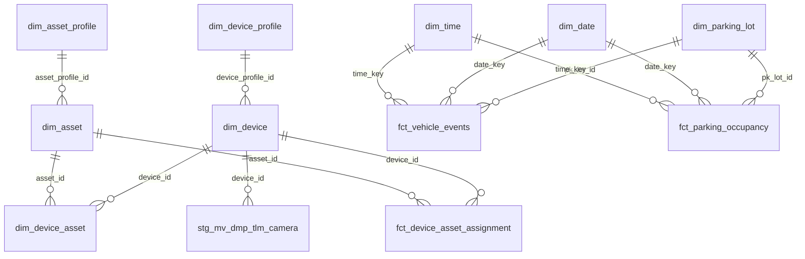

# Table Relationships

Tài liệu join/lineage giữa các bảng. Đối chiếu mô tả từng bảng tại [description.md](./description.md).

**Quy ước**

| Loại | Ý nghĩa |
| --- | --- |
| **Lineage** | Bảng A được build từ bảng B (transform / aggregate) |
| **Join** | Hai bảng có thể nối qua khóa logic (dùng cho Wren semantic model) |
| **Lookup** | Tra cứu thuộc tính mô tả từ dimension |

> StarRocks **không enforce FK**. Các quan hệ dưới đây chỉ phục vụ semantic modeling và GenBI.

---

## 1. Data lineage (luồng dữ liệu)

```
MART (sdp_mart)
  └── DIM / FCT (sdp_golden)
        └── STG (sdp_staging, sdp_near_realtime MV)
              └── RAW (sdp_raw, sdp_near_realtime)
```

### 1.1 DMP Asset & Profile

```
dim_asset_profile (asset_profile_id)
  └── stg_dmp_asset_profiles (asset_profile_id)
        └── raw_dmp_public_asset_profile (id)

dim_asset (asset_id, asset_profile_id)
  ├── stg_dmp_assets (asset_id)
  |      └── raw_dmp_public_asset (id)
  └── stg_dmp_asset_profiles (asset_profile_id)
```

### 1.2 DMP Device & Profile

```
dim_device_profile (device_profile_id)
  └── stg_dmp_device_profiles (device_profile_id)
        └── raw_dmp_public_device_profile (id)

dim_device (device_id, device_profile_id)
  ├── stg_dmp_devices (device_id)
  |      └── raw_dmp_public_device (id)
  └── stg_dmp_device_profiles (device_profile_id)
```

### 1.3 DMP Device ↔ Asset

```
dim_device_asset (device_id, asset_id)
  └── stg_dmp_relations (from_id / to_id)
        └── raw_dmp_public_relation (from_id / to_id)

fct_device_asset_assignment (device_id, asset_id)
  └── stg_dmp_relations (from_id / to_id)
        └── raw_dmp_public_relation (from_id / to_id)
```

### 1.4 Connectivity & Status

```
dim_device (device_id)
  ├── stg_dmp_evt_connectivity (deviceid)
  |      └── raw_dmp_evt_connectivity (deviceId)
  └── stg_dmp_device_status_events (device_id)
         └── raw_dmp_evt_connectivity (deviceId)
```

### 1.5 Telemetry

```
dim_device (device_id)
  ├── stg_mv_dmp_tlm_camera (deviceId)
  |      └── raw_dmp_tlm_raw (deviceId)
  ├── stg_mv_dmp_tlm_chiller (deviceId)
  |      └── raw_dmp_tlm_raw (deviceId)
  ├── stg_mv_dmp_tlm_energy_meter (deviceId)
  |      └── raw_dmp_tlm_raw (deviceId)
  └── stg_mv_dmp_tlm_nvr (deviceId)
         └── raw_dmp_tlm_raw (deviceId)
```

### 1.6 Parking

```
dim_parking_lot (pk_lot_id)
  └── stg_vehicle_histories (pk_lot_id)
        └── raw_parking_db_vehicle_histories (id)

fct_vehicle_events (event_id)
  └── stg_vehicle_histories (event_id)
        └── raw_parking_db_vehicle_histories (id)

fct_parking_occupancy (parking_lot_id, occupancy_date_key, occupancy_time_key)
  └── fct_vehicle_events (aggregate by parking_lot_id, check_in_date_key, check_in_time_key)
```

### 1.7 SCD / Snapshot

```
dim_device_asset (device_sk, asset_sk)
  └── dim_device_asset_snapshot (device_sk, asset_sk)

dim_parking_lot (pk_lot_id)
  └── dim_parking_lot_snapshot (pk_lot_id)
```

### 1.8 Generated dimensions

```
(generated) dim_date
(generated) dim_time
```

---

## 2. Join relationships theo domain

### 2.1 Asset profile

| Từ bảng | Cột | Đến bảng | Cột | Loại |
| --- | --- | --- | --- | --- |
| `stg_dmp_asset_profiles` | `asset_profile_id` | `raw_dmp_public_asset_profile` | `id` | Lineage |
| `stg_dmp_assets` | `asset_profile_id` | `stg_dmp_asset_profiles` | `asset_profile_id` | Join |
| `stg_dmp_assets` | `asset_id` | `raw_dmp_public_asset` | `id` | Lineage |
| `stg_dmp_assets` | `asset_id` | `dim_asset` | `asset_id` | Join |
| `dim_asset` | `asset_profile_id` | `dim_asset_profile` | `asset_profile_id` | Join |
| `dim_asset_profile` | `asset_profile_id` | `stg_dmp_asset_profiles` | `asset_profile_id` | Lineage |

### 2.2 Device profile

| Từ bảng | Cột | Đến bảng | Cột | Loại |
| --- | --- | --- | --- | --- |
| `stg_dmp_device_profiles` | `device_profile_id` | `raw_dmp_public_device_profile` | `id` | Lineage |
| `stg_dmp_devices` | `device_profile_id` | `stg_dmp_device_profiles` | `device_profile_id` | Join |
| `stg_dmp_devices` | `device_id` | `raw_dmp_public_device` | `id` | Lineage |
| `stg_dmp_devices` | `device_id` | `dim_device` | `device_id` | Join |
| `dim_device` | `device_profile_id` | `dim_device_profile` | `device_profile_id` | Join |
| `dim_device_profile` | `device_profile_id` | `stg_dmp_device_profiles` | `device_profile_id` | Lineage |

### 2.3 Device ↔ Asset (bridge & fact)

| Từ bảng | Cột | Đến bảng | Cột | Loại |
| --- | --- | --- | --- | --- |
| `stg_dmp_relations` | `from_id` + `from_type = 'DEVICE'` | `stg_dmp_devices` | `device_id` | Join* |
| `stg_dmp_relations` | `to_id` + `to_type = 'ASSET'` | `stg_dmp_assets` | `asset_id` | Join* |
| `stg_dmp_relations` | — | `raw_dmp_public_relation` | — | Lineage |
| `dim_device_asset` | `device_sk`, `device_id` | `dim_device` | `device_sk`, `device_id` | Join |
| `dim_device_asset` | `asset_sk`, `asset_id` | `dim_asset` | `asset_sk`, `asset_id` | Join |
| `dim_device_asset` | — | `stg_dmp_relations` | — | Lineage |
| `fct_device_asset_assignment` | `device_sk`, `device_id` | `dim_device` | `device_sk`, `device_id` | Join |
| `fct_device_asset_assignment` | `asset_sk`, `asset_id` | `dim_asset` | `asset_sk`, `asset_id` | Join |
| `fct_device_asset_assignment` | — | `stg_dmp_relations` | — | Lineage |
| `dim_device_asset_snapshot` | `device_sk`, `asset_sk` | `dim_device_asset` | `device_sk`, `asset_sk` | Lineage / Join |
| `dim_device_asset_snapshot` | `device_sk` | `dim_device` | `device_sk` | Join |
| `dim_device_asset_snapshot` | `asset_sk` | `dim_asset` | `asset_sk` | Join |

\* `stg_dmp_relations` là bảng polymorphic: `from_id`/`to_id` chỉ có nghĩa khi xét kèm `from_type`/`to_type`. Với fake data hiện tại, `from_type = DEVICE` và `to_type = ASSET`.

> Lưu ý: model Wren nên ưu tiên join qua `dim_device_asset` hoặc `fct_device_asset_assignment` thay vì join trực tiếp với `stg_dmp_relations`, trừ khi cần lineage/gốc quan hệ.

### 2.3a Mô tả chi tiết: Sự tương tác qua DMP Relation

#### Mô hình Polymorphic

`raw_dmp_public_relation` (RAW) lưu trữ quan hệ giữa các entity theo mô hình polymorphic:

```
from_id       (UUID)   — ID entity nguồn
from_type     (STRING) — Loại entity nguồn: DEVICE, ASSET, ...
to_id         (UUID)   — ID entity đích
to_type       (STRING) — Loại entity đích: DEVICE, ASSET, ...
relation_type (STRING) — Loại quan hệ: Contains, Links, ...
```

**Ví dụ fake data:**
```
from_id                          from_type  to_id                            to_type  relation_type
e9d88958-1234-5678-9abc-def012345678  DEVICE     6ef9b1c0-abcd-ef01-2345-6789abcdef0  ASSET    Contains
```

#### Chuẩn hóa trong STG

`stg_dmp_relations` (STG) giữ nguyên cấu trúc polymorphic nhưng thêm metadata load:

- Cột ID không bị đổi tên (giữ `from_id`, `to_id`)
- Giữ kèm `from_type`, `to_type` để xác định mapping chính xác
- Thêm timestamp load, tenant_id, etc.

#### Join với Staging

Khi join `stg_dmp_relations` với staging devices/assets:

```sql
-- Join với device (khi from_type = 'DEVICE')
FROM stg_dmp_relations rel
LEFT JOIN stg_dmp_devices dev ON rel.from_id = dev.device_id
WHERE rel.from_type = 'DEVICE'

-- Join với asset (khi to_type = 'ASSET')
LEFT JOIN stg_dmp_assets ast ON rel.to_id = ast.asset_id
WHERE rel.to_type = 'ASSET'
```

#### Flatten vào Golden Layer

**`dim_device_asset` (DIM bridge):**
- Lấy các bảng từ `stg_dmp_relations` (chỉ DEVICE → ASSET)
- Enrich với thông tin từ `dim_device` và `dim_asset`
- Kết quả: cột rõ ràng `device_id`, `asset_id` (+ `device_sk`, `asset_sk`)

**`fct_device_asset_assignment` (FCT):**
- Tương tự như `dim_device_asset` nhưng dạng fact table
- Ghi lại version/timestamp của mỗi assignment
- Cột rõ ràng `device_id`, `asset_id`, `device_sk`, `asset_sk`

#### Tại sao flatten?

- `stg_dmp_relations` là generic/polymorphic, khó query trực tiếp
- Model Wren cần FK rõ ràng: không join mù `from_id` với cả device + asset
- `dim_device_asset` / `fct_device_asset_assignment` đã chọn entity type rồi → join an toàn

### 2.4 Connectivity & device status

| Từ bảng | Cột | Đến bảng | Cột | Loại |
| --- | --- | --- | --- | --- |
| `stg_dmp_evt_connectivity` | `deviceid` | `dim_device` | `device_id` | Join |
| `stg_dmp_evt_connectivity` | — | `raw_dmp_evt_connectivity` | — | Lineage |
| `stg_dmp_device_status_events` | `device_id` | `dim_device` | `device_id` | Join |
| `stg_dmp_device_status_events` | `device_id` | `raw_dmp_evt_connectivity` | `deviceId` | Lineage (optional) |
| `raw_dmp_evt_connectivity` | `deviceId` | `dim_device` | `device_id` | Join (raw, không khuyến nghị model) |

### 2.5 Telemetry MV

| Từ bảng | Cột | Đến bảng | Cột | Loại |
| --- | --- | --- | --- | --- |
| `stg_mv_dmp_tlm_camera` | `deviceId` | `dim_device` | `device_id` | Join |
| `stg_mv_dmp_tlm_chiller` | `deviceId` | `dim_device` | `device_id` | Join |
| `stg_mv_dmp_tlm_energy_meter` | `deviceId` | `dim_device` | `device_id` | Join |
| `stg_mv_dmp_tlm_nvr` | `deviceId` | `dim_device` | `device_id` | Join |
| `stg_mv_dmp_tlm_*` | — | `raw_dmp_tlm_raw` | — | Lineage |
| `raw_dmp_tlm_raw` | `deviceId` | `dim_device` | `device_id` | Join (raw, không khuyến nghị model) |

### 2.6 Parking — vehicle events

| Từ bảng | Cột | Đến bảng | Cột | Loại |
| --- | --- | --- | --- | --- |
| `stg_vehicle_histories` | `event_id` | `fct_vehicle_events` | `event_id` | Lineage |
| `stg_vehicle_histories` | `pk_lot_id` | `dim_parking_lot` | `pk_lot_id` | Join |
| `stg_vehicle_histories` | — | `raw_parking_db_vehicle_histories` | `id` | Lineage |
| `fct_vehicle_events` | `parking_lot_id` | `dim_parking_lot` | `pk_lot_id` | Join |
| `fct_vehicle_events` | `check_in_date_key` | `dim_date` | `date_key` | Join |
| `fct_vehicle_events` | `check_out_date_key` | `dim_date` | `date_key` | Join |
| `fct_vehicle_events` | `check_in_time_key` | `dim_time` | `time_key` | Join |
| `fct_vehicle_events` | `check_out_time_key` | `dim_time` | `time_key` | Join |
| `dim_parking_lot` | — | `stg_vehicle_histories` | `pk_lot_id` | Lineage |

### 2.7 Parking — occupancy mart

| Từ bảng | Cột | Đến bảng | Cột | Loại |
| --- | --- | --- | --- | --- |
| `fct_parking_occupancy` | `parking_lot_id`, `occupancy_date_key`, `occupancy_time_key` | `fct_vehicle_events` | `parking_lot_id`, `check_in_date_key` (hoặc `check_out_date_key`), `check_in_time_key` | Lineage (aggregate) |
| `fct_parking_occupancy` | `parking_lot_id` | `dim_parking_lot` | `pk_lot_id` | Join |
| `fct_parking_occupancy` | `occupancy_date_key` | `dim_date` | `date_key` | Join |
| `fct_parking_occupancy` | `occupancy_time_key` | `dim_time` | `time_key` | Join |

**Ghi chú:** `fct_parking_occupancy` là bảng **aggregate** từ `fct_vehicle_events`, gồm: số slot khả dụng, số xe hiện tại, tỉ lệ occupancy, v.v. Aggregate theo `GROUP BY parking_lot_id, occupancy_date_key, occupancy_time_key`.

### 2.8 Parking lot SCD

| Từ bảng | Cột | Đến bảng | Cột | Loại |
| --- | --- | --- | --- | --- |
| `dim_parking_lot_snapshot` | `pk_lot_id` | `dim_parking_lot` | `pk_lot_id` | Join / Lineage |
| `dim_parking_lot_snapshot` | `dbt_valid_from`, `dbt_valid_to` | — | — | SCD validity |

---

## 3. Ma trận quan hệ theo bảng (semantic layer)

Chỉ liệt kê bảng **nên model trong Wren** (STG / DIM / FCT / MART / MV). Bỏ RAW.

| Bảng | Nối tới |
| --- | --- |
| `stg_dmp_asset_profiles` | `stg_dmp_assets`, `dim_asset_profile` |
| `stg_dmp_assets` | `stg_dmp_asset_profiles`, `dim_asset` |
| `stg_dmp_device_profiles` | `stg_dmp_devices`, `dim_device_profile` |
| `stg_dmp_devices` | `stg_dmp_device_profiles`, `dim_device` |
| `stg_dmp_device_status_events` | `dim_device` |
| `stg_dmp_evt_connectivity` | `dim_device` |
| `stg_dmp_relations` | `stg_dmp_devices`, `stg_dmp_assets`, `dim_device_asset`, `fct_device_asset_assignment` |
| `stg_vehicle_histories` | `dim_parking_lot`, `fct_vehicle_events` |
| `dim_asset` | `dim_asset_profile`, `dim_device_asset`, `fct_device_asset_assignment` |
| `dim_asset_profile` | `dim_asset` |
| `dim_device` | `dim_device_profile`, `dim_device_asset`, `fct_device_asset_assignment`, `stg_mv_dmp_tlm_*` |
| `dim_device_profile` | `dim_device` |
| `dim_device_asset` | `dim_device`, `dim_asset`, `dim_device_asset_snapshot` |
| `dim_device_asset_snapshot` | `dim_device_asset`, `dim_device`, `dim_asset` |
| `dim_parking_lot` | `fct_vehicle_events`, `fct_parking_occupancy`, `dim_parking_lot_snapshot` |
| `dim_parking_lot_snapshot` | `dim_parking_lot` |
| `dim_date` | `fct_vehicle_events`, `fct_parking_occupancy` |
| `dim_time` | `fct_vehicle_events`, `fct_parking_occupancy` |
| `fct_device_asset_assignment` | `dim_device`, `dim_asset` |
| `fct_vehicle_events` | `dim_parking_lot`, `dim_date`, `dim_time`, `fct_parking_occupancy` |
| `fct_parking_occupancy` | `dim_parking_lot`, `dim_date`, `dim_time` |
| `stg_mv_dmp_tlm_camera` | `dim_device` |
| `stg_mv_dmp_tlm_chiller` | `dim_device` |
| `stg_mv_dmp_tlm_energy_meter` | `dim_device` |
| `stg_mv_dmp_tlm_nvr` | `dim_device` |

---

## 4. Quan hệ bắt buộc khi deploy Wren (sdp_golden + sdp_mart)

Ưu tiên tạo các relationship sau trong Wren UI:

1. `dim_device.device_profile_id` → `dim_device_profile.device_profile_id`
2. `dim_asset.asset_profile_id` → `dim_asset_profile.asset_profile_id`
3. `dim_device_asset.device_id` → `dim_device.device_id` (hoặc `device_sk`)
4. `dim_device_asset.asset_id` → `dim_asset.asset_id` (hoặc `asset_sk`)
5. `fct_device_asset_assignment.device_id` → `dim_device.device_id`
6. `fct_device_asset_assignment.asset_id` → `dim_asset.asset_id`
7. `fct_vehicle_events.parking_lot_id` → `dim_parking_lot.pk_lot_id`
8. `fct_vehicle_events.check_in_date_key` → `dim_date.date_key`
9. `fct_vehicle_events.check_out_date_key` → `dim_date.date_key`
10. `fct_vehicle_events.check_in_time_key` → `dim_time.time_key`
11. `fct_vehicle_events.check_out_time_key` → `dim_time.time_key`
12. `fct_parking_occupancy.parking_lot_id` → `dim_parking_lot.pk_lot_id`
13. `fct_parking_occupancy.occupancy_date_key` → `dim_date.date_key`
14. `fct_parking_occupancy.occupancy_time_key` → `dim_time.time_key`
15. `stg_mv_dmp_tlm_*.deviceId` → `dim_device.device_id`

---

## 5. Lưu ý cột đặc biệt

| Vấn đề | Chi tiết |
| --- | --- |
| **Casing khác nhau** | Raw/MV dùng `deviceId`; staging connectivity dùng `deviceid`; golden dùng `device_id`. |
| **Surrogate key vs business key** | Golden layer có cả `*_sk` và `*_id`. Join business key (`*_id`) thường dễ hiểu hơn cho LLM. |
| **Parking lot key** | Dimension: `pk_lot_id`; facts: `parking_lot_id`. |
| **SCD** | `dim_device_asset_snapshot`, `dim_parking_lot_snapshot` dùng `dbt_valid_from` / `dbt_valid_to` cho point-in-time. |
| **Conditional join** | `stg_dmp_relations` cần `from_type` / `to_type` để biết join device hay asset. |

---

## 6. Sơ đồ tổng quan (semantic)


