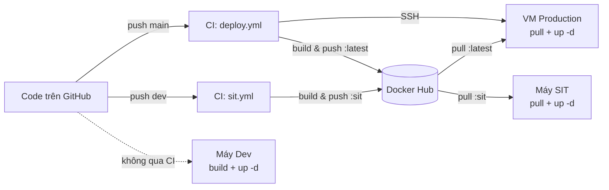
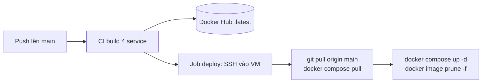

# Hướng dẫn Vận hành & Triển khai (How to Run) — Wren AI


---

## 1. Giới thiệu

### 1.1. Tổng quan 3 môi trường

Hệ thống có 3 môi trường, mỗi môi trường gắn với một cặp file `docker-compose` + file `.env` riêng:

| Môi trường | Vai trò | Khi nào dùng | docker-compose | env file | Nguồn image |
|---|---|---|---|---|---|
| **Development** | Phát triển & test thay đổi cục bộ | Khi bạn sửa code và muốn chạy thử trên máy mình | `docker-compose.dev.yaml` | `.env.dev` | **Build tại chỗ** (`*:local`) |
| **SIT** | Kiểm thử tích hợp (System Integration Test) | Khi cần kiểm thử bản tích hợp trước khi lên prod | `docker-compose.sit.yaml` | `.env.sit` | Pull tag `:sit` từ Docker Hub |
| **Production** | Chạy thật cho người dùng cuối | Vận hành chính thức | `docker-compose.prod.yaml` | `.env` | Pull tag `:latest` từ Docker Hub |

**Cơ chế chạy chung** — mọi lệnh đều theo mẫu:

```bash
docker compose --env-file <.env|.env.sit|.env.dev> -f docker-compose.<prod|sit|dev>.yaml <command>
```

Việc tách `--env-file` và `-f` cho phép chuyển môi trường chỉ bằng cách đổi tham số, không phải sửa file.

### 1.2. Mô hình build → push → deploy



- **Production**: push `main` → CI tự build, push image, rồi SSH vào VM để cập nhật (tự động hoàn toàn).
- **SIT**: push `dev` → CI build & push image `:sit`; máy SIT **tự pull** về chạy (không tự deploy).
- **Development**: không qua CI; build trực tiếp trên máy từ source code.

---

## 2. Yêu cầu & chuẩn bị (Prerequisites)

### 2.1. Công cụ cần cài

| Công cụ | Kiểm tra phiên bản | Ghi chú |
|---|---|---|
| Git | `git --version` | Để clone source |
| Docker Engine | `docker --version` | Bắt buộc |
| Docker Compose v2 | `docker compose version` | Phải là **`docker compose`** (có dấu cách), không phải `docker-compose` cũ |
| Tài khoản GitHub | — | Để cấu hình CI/CD secrets |
| Tài khoản Docker Hub | — | Để lưu & kéo image |

> Nếu chỉ chạy môi trường **dev** trên máy cá nhân, bạn chỉ cần Git + Docker. Docker Hub và GitHub Secrets là bắt buộc cho **SIT** và **production**.

### 2.2. Clone source & submodule

`wren-engine` là một **git submodule**, nên phải clone kèm submodule:

```bash
git clone --recurse-submodules <repo-url> wren-ai
cd wren-ai
```

Nếu đã lỡ clone mà quên submodule (thư mục `wren-engine/` trống), chạy:

```bash
git submodule update --init --recursive
```

> CI cũng checkout với `submodules: recursive` — nếu submodule không được init, bước build `wren-engine` / `ibis-server` sẽ thất bại.

### 2.3. Key & secret cần chuẩn bị trước

Chuẩn bị sẵn các giá trị sau trước khi bắt đầu:

- **`OPENAI_API_KEY`** (hoặc khoá của LLM provider khác) — lấy từ LLM provider (OpenAI).
- **Tài khoản Docker Hub** — username + Access Token (mục 3).
- **Quyền SSH tới VM production** — host, user, port, private key (chỉ cần cho production, mục 4.3).
- (Tuỳ chọn) `LANGFUSE_SECRET_KEY` / `LANGFUSE_PUBLIC_KEY` cho observability; `OPENMETADATA_URL` / `OPENMETADATA_TOKEN` nếu dùng OpenMetadata.


---

## 3. Thiết lập Docker Hub (step by step)

Docker Hub là nơi CI **đẩy (push)** image lên, và các môi trường SIT/production **kéo (pull)** image về.

### 3.1. Tạo tài khoản & repository

1. Đăng ký tài khoản tại [hub.docker.com](https://hub.docker.com).
2. Ghi nhớ **username** — đây sẽ là prefix của tất cả image.

CI sẽ đẩy 4 image (tên khớp `<username>/<image>` trong workflow):

| Image | Cấu phần |
|---|---|
| `<username>/wren-ui` | Wren UI (frontend + BFF) |
| `<username>/wren-ai-service` | Wren AI Service |
| `<username>/wren-engine-ibis` | Wren Engine v3 (ibis-server + lõi Rust) |
| `<username>/wren-engine` | Wren Engine v2 (Java, fallback) |

> Docker Hub sẽ tự tạo repository khi push lần đầu (với tài khoản free, repository ở chế độ public).

### 3.2. Tạo Access Token

CI không dùng mật khẩu, mà dùng Access Token:

1. Vào **Account Settings → Security → Personal access tokens → New Access Token**.
2. Đặt tên gì cũng được, chọn quyền **Read & Write**.
3. **Copy token** — Docker Hub chỉ hiển thị token một lần duy nhất.

Token này sẽ được lưu vào GitHub Secret `DOCKERHUB_TOKEN` (mục 4).

### 3.3. Cơ chế tag image theo môi trường

| Workflow | Trigger | Tag đẩy lên |
|---|---|---|
| `deploy.yml` (production) | push `main` | `:latest` + `:<git-sha>` |
| `sit.yml` (SIT) | push `dev` | `:sit` + `:<git-sha>` |
| (dev) | — | không đẩy; build local thành `*:local` |

Tag `:<git-sha>` (theo commit) giúp truy vết và rollback về một bản build cụ thể.

### 3.4. ⚠️ Lưu ý quan trọng: đổi prefix image trong compose

Hiện tại `docker-compose.prod.yaml` và `docker-compose.sit.yaml` **hardcode** prefix image theo một tài khoản cụ thể, ví dụ:

```yaml
# docker-compose.prod.yaml
wren-ui:
  image: lilmeen1012/wren-ui:latest
ibis-server:
  image: lilmeen1012/wren-engine-ibis:latest
wren-ai-service:
  image: lilmeen1012/wren-ai-service:latest
```

Khi dùng tài khoản Docker Hub khác của bản thân, **phải sửa các dòng `image:`** này (cả file `.prod` và `.sit`) sang `<username-mới>/...`. Nếu không, môi trường sẽ kéo image của người khác (hoặc lỗi không tìm thấy).

> Riêng `wren-engine` (Java) trỏ tới image upstream `ghcr.io/canner/wren-engine:0.22.0` — **không cần đổi** (xem mục 8.5).

---

## 4. Thiết lập GitHub Secrets (step by step)

Secrets giúp 2 workflow CI đăng nhập Docker Hub và SSH vào VM mà không lộ thông tin cấu hình trong code.

### 4.1. Vào đúng nơi cấu hình

Trên trang GitHub của repository:

**Settings → Secrets and variables → Actions → New repository secret**

Với mỗi secret: nhập **Name** (đúng chính tả, phân biệt hoa thường) và **Secret** (giá trị), rồi **Add secret**.

> 📷 *Cần bổ sung screenshot màn hình "New repository secret" cho người mới dễ hình dung.*

### 4.2. Bảng secret bắt buộc

| Secret | Dùng cho | Ý nghĩa | Ví dụ giá trị |
|---|---|---|---|
| `DOCKERHUB_USERNAME` | cả 2 workflow | Username Docker Hub (prefix image) | `myuser` |
| `DOCKERHUB_TOKEN` | cả 2 workflow | Access Token tạo ở mục 3.2 | `dckr_pat_xxx...` |
| `VM_HOST` | chỉ `deploy.yml` (prod) | IP/hostname VM production | `203.0.113.10` |
| `VM_USER` | chỉ `deploy.yml` (prod) | User SSH trên VM | `ubuntu` |
| `VM_SSH_KEY` | chỉ `deploy.yml` (prod) | **Private key** SSH (toàn bộ nội dung) | `-----BEGIN OPENSSH...` |
| `VM_PORT` | chỉ `deploy.yml` (prod) | Cổng SSH | `22` |

> `sit.yml` chỉ cần `DOCKERHUB_USERNAME` + `DOCKERHUB_TOKEN` (vì không tự deploy). 4 secret `VM_*` chỉ cần cho production.

### 4.3. Tạo SSH key cho deploy (chỉ production)

Trên máy của bạn:

```bash
ssh-keygen -t ed25519 -C "wren-deploy" -f wren_deploy_key
```

Sẽ sinh ra 2 file: `wren_deploy_key` (private) và `wren_deploy_key.pub` (public).

1. Thêm **public key** vào VM: dán nội dung `wren_deploy_key.pub` vào file `~/.ssh/authorized_keys` trên VM (user = `VM_USER`).
2. Dán **toàn bộ nội dung private key** `wren_deploy_key` vào GitHub Secret `VM_SSH_KEY`.
3. Kiểm tra đăng nhập được: `ssh -i wren_deploy_key -p <VM_PORT> <VM_USER>@<VM_HOST>`.

### 4.4. Kiểm tra workflow trigger

| Hành động | Workflow chạy |
|---|---|
| `git push` lên nhánh `main` | `deploy.yml` (build + deploy production) |
| `git push` lên nhánh `dev` | `sit.yml` (build & push `:sit`) |
| Bấm tay trong tab **Actions** | Cả hai đều hỗ trợ `workflow_dispatch` (chạy thủ công) |

Sau khi push, vào tab **Actions** trên GitHub để theo dõi tiến trình build.

---

## 5. Cấu hình file môi trường (.env & config.yaml)

Tất cả file cấu hình nằm trong thư mục `docker/`.

### 5.1. Tổng quan các file env

| File | Dùng cho môi trường | Ghi chú |
|---|---|---|
| `docker/.env` | Production | |
| `docker/.env.sit` | SIT | |
| `docker/.env.dev` | Development | |
| `docker/.env.example` | (mẫu) | Copy ra để tạo các file trên |

Bắt đầu bằng cách copy file mẫu:

```bash
cd docker
cp .env.example .env        # cho production
# tương tự tạo .env.sit, .env.dev nếu chưa có
cp config.example.yaml config.yaml
```

### 5.2. Các biến quan trọng phải set

Trong `.env` (trích từ `.env.example`):

| Nhóm | Biến | Ý nghĩa |
|---|---|---|
| Vendor key | `OPENAI_API_KEY` | LLM API key |
| Auth | `WREN_INTERNAL_API_SECRET` | Internal API Key chia sẻ cho gọi service-to-service (ai-service → wren-ui). **Bắt buộc set khi bật auth**, nếu không các call dry-run/deploy bị 401 |
| App Database | `DB_TYPE` (`sqlite` \| `pg`), `PG_URL`, `PG_SSL_REJECT_UNAUTHORIZED` | Chọn loại DB. Khi `DB_TYPE=pg` phải set `PG_URL`; đặt `PG_SSL_REJECT_UNAUTHORIZED=false` cho PG managed dùng self-signed cert |
| OpenMetadata | `OPENMETADATA_URL`, `OPENMETADATA_TOKEN` | Tích hợp metadata. Để trống ⇒ tự động tắt tính năng OpenMetadata |
| Model (telemetry) | `GENERATION_MODEL` | Tên model, vd `gpt-4o-mini`. Đây chỉ là chỗ để check nhanh model dùng, chỉ mang tính chất cho biết thông tin, và chỉnh sửa thủ công nếu thay đổi model. Để xác định mô hình được sử dụng thực tế, xem file config.yml vì ứng dụng đọc tham số mô hình ở đây |
| Cổng host | `HOST_PORT`, `AI_SERVICE_FORWARD_PORT` | Cổng UI / AI service expose ra máy (mặc định 3000 / 5555) |
| Cổng nội bộ | `WREN_ENGINE_PORT` (8080), `WREN_ENGINE_SQL_PORT` (7432), `WREN_AI_SERVICE_PORT` (5555), `WREN_UI_PORT` (3000), `IBIS_SERVER_PORT` (8000) | Cổng giữa các service |
| Version image | `WREN_UI_VERSION`, `WREN_AI_SERVICE_VERSION`, `WREN_ENGINE_VERSION`, `IBIS_SERVER_VERSION`, `WREN_BOOTSTRAP_VERSION`, `WREN_PRODUCT_VERSION` | Phiên bản image |
| Observability | `LANGFUSE_SECRET_KEY`, `LANGFUSE_PUBLIC_KEY`, `TELEMETRY_ENABLED`, `POSTHOG_API_KEY`, `POSTHOG_HOST` | Tuỳ chọn |
| Khác | `PLATFORM` (vd `linux/amd64`), `PROJECT_DIR`, `USER_UUID`, `QDRANT_HOST`, `SHOULD_FORCE_DEPLOY`, `LOCAL_STORAGE`, `EXPERIMENTAL_ENGINE_RUST_VERSION`, `WREN_UI_ENDPOINT` | |

> Cấu hình **model AI** (LLM/embedder cụ thể) đặt trong `config.yaml`, **không** đặt trong `.env`.
>
> ⚠️ **Bảo mật**: `.env.example` chỉ là template (giá trị rỗng). Các file `.env` / `.env.sit` / `.env.dev` chứa secret thật (`OPENAI_API_KEY`, `PG_URL` kèm mật khẩu, `WREN_INTERNAL_API_SECRET`, `OPENMETADATA_TOKEN`...).


### 5.3. Cấu hình AI service (config.yaml)

1. Copy mẫu: `cp config.example.yaml config.yaml` (đã làm ở 5.1).
2. Mở `config.yaml`, cấu hình LLM provider, embedder và model muốn dùng.
3. Chi tiết đầy đủ cho từng provider/model: xem `wren-ai-service/docs/configuration.md`.

> Khi đổi `config.yaml`, restart riêng AI service: `docker compose --env-file <env> -f <compose> up -d --force-recreate wren-ai-service`.

---

## 6. Chạy môi trường Development

### 6.1. Vai trò môi trường dev

Dùng để **phát triển và test thay đổi cục bộ** trước khi đẩy lên nhánh `dev` (SIT) hoặc `main` (production). Image được **build tại chỗ** từ source (`wren-ui:local`, `wren-ai-service:local`, `wren-engine-ibis:local`) — **không qua CI, không cần Docker Hub**.

### 6.2. Các bước chạy

```bash
cd docker
# đảm bảo đã có .env.dev và config.yaml
docker compose --env-file .env.dev -f docker-compose.dev.yaml up -d --build
```

> Cờ **`--build`** là bắt buộc ở lần đầu (và mỗi khi sửa code) để build lại image local. Lần sau nếu không sửa code có thể bỏ `--build` cho nhanh.

### 6.3. Đặc thù dev

- **Qdrant có healthcheck**: `wren-ai-service` chờ Qdrant healthy mới khởi động (tránh lỗi kết nối khi vừa start).
- **ibis-server `LOG_LEVEL=DEBUG`**: log chi tiết hơn để debug.
- **Expose cổng engine/ibis ra host**: dễ gọi trực tiếp để kiểm tra (vd `http://localhost:8000/health`).
- **`WREN_UI_ENDPOINT`** được set để ai-service gọi callback về UI.

### 6.4. Kiểm tra & truy cập

```bash
# xem trạng thái container
docker compose --env-file .env.dev -f docker-compose.dev.yaml ps

# xem log một service (vd ai-service)
docker compose --env-file .env.dev -f docker-compose.dev.yaml logs -f wren-ai-service

# rebuild lại 1 service sau khi sửa code
docker compose --env-file .env.dev -f docker-compose.dev.yaml up -d --build wren-ui
```

Mở trình duyệt: `http://localhost:<HOST_PORT>` (mặc định `http://localhost:3000`).

---

## 7. Chạy môi trường SIT

### 7.1. Vai trò môi trường SIT

SIT (System Integration Test) là môi trường **kiểm thử tích hợp**: chạy bản image đã build sẵn bởi CI (tag `:sit`), gần giống production nhưng cho phép tester chủ động kéo bản mới về khi cần. CI **không tự deploy** SIT.

### 7.2. Phía CI (tự động)

Khi push lên nhánh `dev`, workflow `sit.yml` tự động:
1. Build 4 service.
2. Push image lên Docker Hub với tag `:sit` (+ `:<git-sha>`).

Theo dõi tiến trình trong tab **Actions**. Khi xong, image `:sit` đã sẵn trên Docker Hub.

### 7.3. Phía máy chạy SIT (thủ công)

Trên máy chạy SIT (đã clone repo, đã chuẩn bị `.env.sit` + `config.yaml`, đã đổi prefix image — mục 3.4):

```bash
cd docker
docker compose --env-file .env.sit -f docker-compose.sit.yaml pull
docker compose --env-file .env.sit -f docker-compose.sit.yaml up -d
```

Muốn cập nhật bản mới: chạy lại đúng 2 lệnh `pull` + `up -d` ở trên.

### 7.4. Đặc thù SIT

- **Hỗ trợ PostgreSQL**: set `DB_TYPE=pg` và `PG_URL` trong `.env.sit` để dùng PostgreSQL thay SQLite.
- **Mount thư mục migrations**: compose SIT mount `wren-ui/migrations` vào container (`/app/migrations:ro`), thuận tiện chạy migration.
- Chạy migration (nếu cần): `docker compose --env-file .env.sit -f docker-compose.sit.yaml exec wren-ui yarn migrate`.

---

## 8. Chạy & triển khai môi trường Production

### 8.1. Vai trò môi trường production

Môi trường **chạy thật cho người dùng cuối**, triển khai **tự động hoàn toàn** từ nhánh `main`.

### 8.2. Chuẩn bị VM server

Một lần duy nhất, trên VM production:

1. Cài Docker + Docker Compose v2.
2. Clone repo vào đúng đường dẫn mà CI mong đợi:
   ```bash
   sudo mkdir -p /workspace
   cd /workspace
   git clone --recurse-submodules <repo-url> wren-ai
   ```
3. Tạo sẵn `docker/.env` (production) + `docker/config.yaml`, và **đổi prefix image** sang Docker Hub của bạn (mục 3.4).
4. Đảm bảo public key deploy đã nằm trong `~/.ssh/authorized_keys` (mục 4.3).

> Đường dẫn `/workspace/wren-ai` khớp với script trong `deploy.yml`. Nếu dùng đường dẫn khác, phải sửa workflow tương ứng.

### 8.3. Luồng deploy tự động



Sau khi build xong, job `deploy` SSH vào VM và chạy:

```bash
cd /workspace/wren-ai
git pull origin main
cd /workspace/wren-ai/docker
docker compose --env-file .env -f docker-compose.prod.yaml pull
docker compose --env-file .env -f docker-compose.prod.yaml up -d
docker image prune -f
docker compose --env-file .env -f docker-compose.prod.yaml ps
```

→ Chỉ cần push `main`, server tự cập nhật.

### 8.4. Triển khai/cập nhật thủ công

Khi cần deploy thủ công (vd rollback), SSH vào VM và chạy lại chuỗi lệnh trên. Để rollback về một bản cũ, đổi tag image trong `.env`/compose sang `:<git-sha>` mong muốn rồi `pull` + `up -d`.

### 8.5. Lưu ý image wren-engine (Java)

`docker-compose.prod.yaml` và `docker-compose.sit.yaml` cố tình dùng image upstream `ghcr.io/canner/wren-engine:0.22.0` cho engine Java thay vì image tự build. Lý do và hệ quả:

- `wren-engine` (Java) chỉ là **engine v2 dùng cho fallback** — không nằm trên đường xử lý chính.
- **Lõi semantic thật sự là `wren-core` (Rust) + `wren-core-py`, được build chung với `ibis-server`** (engine v3). Mà `ibis-server` *do CI tự build & push*.

⇒ Mọi điều chỉnh tầng engine v3 (Rust) đều đi qua CI bình thường thông qua image `wren-engine-ibis`. Không cần build riêng image Java.

---

## 9. Kiểm tra sau khi chạy (Verification)

### 9.1. Health check các service

```bash
# 1. tất cả container đang "Up"
docker compose --env-file <env> -f <compose> ps

# 2. ibis-server trả về healthy (dev expose cổng 8000)
curl http://localhost:8000/health      # kỳ vọng: {"status":"ok"}
```

3. Mở UI tại `http://localhost:<HOST_PORT>`.
4. Thử end-to-end: kết nối một data source, modeling, deploy, rồi đặt một câu hỏi để chắc chắn luồng text-to-SQL hoạt động.

### 9.2. Vị trí log & dữ liệu

- **Log từng service**: `docker compose --env-file <env> -f <compose> logs -f <service>`.
- **Dữ liệu**: các container chia sẻ volume `data`. App Database là SQLite tại `/app/data/db.sqlite3` (prod), hoặc PostgreSQL theo `PG_URL` (sit/dev).

---

## 10. Xử lý sự cố thường gặp (Troubleshooting)

### 10.1. Lỗi cấu hình & secret

| Lỗi | Nguyên nhân | Cách xử lý |
|---|---|---|
| CI báo lỗi đăng nhập Docker Hub | Sai/thiếu `DOCKERHUB_USERNAME`/`DOCKERHUB_TOKEN` | Kiểm tra lại tên + token (mục 4.2) |
| Pull image về sai/không thấy | Quên đổi prefix image trong compose | Sửa dòng `image:` sang username của bạn (mục 3.4) |
| Call AI bị **401** khi bật auth | Thiếu `WREN_INTERNAL_API_SECRET` | Set biến này trong `.env` (mục 5.2) |
| LLM không phản hồi | Thiếu `OPENAI_API_KEY` hoặc sai `config.yaml` | Kiểm tra key + cấu hình model |

### 10.2. Lỗi cổng & tài nguyên

| Lỗi | Nguyên nhân | Cách xử lý |
|---|---|---|
| UI không lên, báo cổng bận | Trùng `HOST_PORT` (3000) | Đổi `HOST_PORT` trong `.env` |
| ai-service crash khi vừa start | Qdrant chưa sẵn sàng | Dev đã có healthcheck; prod/sit thử `up -d` lại hoặc chờ |
| Pull image thất bại | Sai tag (`:latest`/`:sit`) hoặc repo private | Kiểm tra tag & quyền truy cập Docker Hub |

### 10.3. Lỗi deploy production

| Lỗi | Nguyên nhân | Cách xử lý |
|---|---|---|
| Job deploy lỗi SSH | Sai `VM_HOST`/`VM_USER`/`VM_PORT`/`VM_SSH_KEY` | Test `ssh -i key -p port user@host` thủ công |
| `git pull` lỗi trên VM | Có thay đổi cục bộ gây conflict | Trên VM: `git stash` hoặc `git reset --hard origin/main` (cẩn trọng) |
| Image cũ chiếm dung lượng | Chưa prune | `docker image prune -f` (đã có trong script) |

---

## 11. Phụ lục

### 11.1. Bảng tổng hợp lệnh theo môi trường

| Thao tác | Development | SIT | Production |
|---|---|---|---|
| Khởi động | `docker compose --env-file .env.dev -f docker-compose.dev.yaml up -d --build` | `docker compose --env-file .env.sit -f docker-compose.sit.yaml pull && docker compose --env-file .env.sit -f docker-compose.sit.yaml up -d` | `docker compose --env-file .env -f docker-compose.prod.yaml pull && docker compose --env-file .env -f docker-compose.prod.yaml up -d` |
| Dừng | `docker compose --env-file .env.dev -f docker-compose.dev.yaml down` | `docker compose --env-file .env.sit -f docker-compose.sit.yaml down` | `docker compose --env-file .env -f docker-compose.prod.yaml down` |
| Xem log | `... -f docker-compose.dev.yaml logs -f <service>` | `... -f docker-compose.sit.yaml logs -f <service>` | `... -f docker-compose.prod.yaml logs -f <service>` |
| Trạng thái | `... -f docker-compose.dev.yaml ps` | `... -f docker-compose.sit.yaml ps` | `... -f docker-compose.prod.yaml ps` |

### 11.2. Checklist secret & env

**GitHub Secrets:**
- [ ] `DOCKERHUB_USERNAME`
- [ ] `DOCKERHUB_TOKEN`
- [ ] `VM_HOST` *(prod)*
- [ ] `VM_USER` *(prod)*
- [ ] `VM_SSH_KEY` *(prod)*
- [ ] `VM_PORT` *(prod)*

**File env bắt buộc set:**
- [ ] `OPENAI_API_KEY` (hoặc khoá LLM tương ứng)
- [ ] `WREN_INTERNAL_API_SECRET` (khi bật auth)
- [ ] `GENERATION_MODEL`
- [ ] `HOST_PORT` (nếu 3000 bị trùng)
- [ ] `DB_TYPE` (+ `PG_URL`, `PG_SSL_REJECT_UNAUTHORIZED` nếu dùng PostgreSQL cho SIT/dev)
- [ ] `OPENMETADATA_URL` + `OPENMETADATA_TOKEN` (nếu dùng OpenMetadata; để trống nếu không)
- [ ] Đã đổi prefix `image:` trong compose prod/sit sang Docker Hub username của bạn
- [ ] Đã tạo `config.yaml` từ `config.example.yaml`
- [ ] Đã chắc chắn các file `.env*` chứa secret thật **không** bị commit lên git
