# Tài liệu Thiết kế Kiến trúc Phần mềm (Software Architecture Document) — Wren AI

> Phiên bản nháp đầu tiên. Một số hình trong tài liệu được vẽ ở dạng **draft (Mermaid)** để minh hoạ ý tưởng; chúng được đánh dấu rõ và dự kiến sẽ được vẽ lại bằng draw.io.

---

## 1. Giới thiệu (Introduction)

### 1.1. Mục đích tài liệu

Tài liệu này mô tả **kiến trúc kỹ thuật** của toàn bộ hệ thống Wren AI: cách hệ thống được chia thành các cấu phần, trách nhiệm của từng cấu phần, cách chúng giao tiếp với nhau, mô hình dữ liệu, và các vấn đề xuyên suốt (auth, cấu hình, observability, xử lý lỗi, caching, triển khai).

### 1.2. Phạm vi (Scope)

Tài liệu bao phủ 3 cấu phần chính cùng các hạ tầng hỗ trợ khác:

| Trong phạm vi | Ghi chú |
|---|---|
| **Wren UI** (`wren-ui/`) | Frontend (Next.js) + Backend-for-Frontend (Apollo GraphQL) |
| **Wren AI Service** (`wren-ai-service/`) | Dịch vụ AI: text-to-SQL, chart, recommendation... |
| **Wren Engine** (`wren-engine/`) | Semantic layer + thực thi truy vấn tới data source |
| Các hạ tầng hỗ trợ khác | LLM Provider, Vector Database (Qdrant), App Database (SQLite/PostgreSQL), Data Sources |

Các phần **không** thuộc phạm vi tài liệu này: `wren-launcher` (công cụ khởi chạy bằng Go), chi tiết triển khai Kubernetes (`deployment/kustomizations`), và đặc tả chức năng nghiệp vụ chi tiết (được mô tả trong tài liệu FSD).

### 1.3. Tài liệu tham khảo (References)

- Conceptual diagram: `docs/software_architecture/images/wren-ai-architecture-Conceptual Diagram.drawio.svg`
- Functional Specification Document (FSD): `docs/functional_specification/fsd.md`
- README của các subproject: `wren-ui/README.md`, `wren-ai-service/README.md`, `wren-engine/ibis-server/README.md`
- WrenMDL manifest schema: `wren-mdl/mdl.schema.json`
- Repository gốc: [Canner/WrenAI](https://github.com/Canner/WrenAI), [Canner/wren-engine](https://github.com/Canner/wren-engine)

---

## 2. Kiến trúc tổng thể (High-level Architecture)

### 2.1. Conceptual diagram & diễn giải


Hệ thống Wren AI là một nền tảng **GenBI** (Generative Business Intelligence): người dùng đặt câu hỏi bằng ngôn ngữ tự nhiên, hệ thống tự sinh SQL, thực thi và trả về câu trả lời/biểu đồ. Conceptual diagram chia hệ thống thành 3 cấu phần chính:

- **Wren UI** — nơi người dùng tương tác. Gồm `Client` (trình duyệt) và `Server` (BFF). Từ đây phát sinh các luồng: đặt câu hỏi (*Question*), sinh SQL (*Generate SQL*), định nghĩa schema (*Define Schema* → *Modeling* → *MDL*), kết nối nguồn dữ liệu (*Connect Data source*).
- **Wren AI Service** — xử lý các tác vụ cần dùng LLM hay VectorDB. Có nhiệm vụ nhận câu hỏi, **Classify Intent** (phân loại ý định), **Retrieval** (truy hồi ngữ cảnh từ **Vector Database**), **Embedding & Index Processing** (đánh chỉ mục MDL khi deploy), và **Prompt Builder** dựng prompt gửi tới **LLM Provider** để lấy *Answer*.
- **Wren Engine** — lớp ngữ nghĩa + thực thi. Nhận *Semantic SQL* và *Manifest* (MDL), đi qua chuỗi **Ibis Server → Validator → Rewriter → Transpiler → Data source Connector** để dịch ra SQL gốc của nguồn dữ liệu và truy vấn (*Query Data*) trên **Data Sources**.

Hai luồng trả lời chính trong diagram:
- **1a** (câu hỏi chung / gây hiểu nhầm): Classify Intent → Prompt Builder → LLM → *Answer* trực tiếp, không sinh SQL.
- **1b** (text-to-SQL): Classify Intent → Retrieval → Vector Database → Prompt Builder → LLM → SQL, sau đó SQL được Wren Engine thực thi để lấy dữ liệu.

### 2.2. Các cấu phần chính & trách nhiệm

| Cấu phần | Công nghệ | Trách nhiệm chính |
|---|---|---|
| **Wren UI — Frontend** | Next.js 14, React 18, Apollo Client, Ant Design, ReactFlow, Vega | Giao diện: setup wizard, modeling, hỏi-đáp (ask), dashboard |
| **Wren UI — BFF** | Apollo Server (GraphQL) trên Next.js API route | Điều phối nghiệp vụ, gọi 3 service backend, lưu metadata ứng dụng |
| **Wren AI Service** | Python, FastAPI, Hamilton, Haystack, LiteLLM | Chạy các pipeline AI: indexing, retrieval, generation (text-to-SQL...) |
| **Wren Engine (ibis-server)** | Python, FastAPI, Ibis, wren-core (Rust/PyO3) | Phân tích MDL, validate/rewrite/transpile SQL, thực thi trên data source |
| **Wren Engine (Java)** | Java | Engine v2 cũ — đường dự phòng (fallback) khi v3 lỗi |
| **LLM Provider** | OpenAI / các LLM qua LiteLLM | Sinh văn bản: phân loại intent, sinh SQL, sinh câu trả lời |
| **Vector Database** | Qdrant | Lưu embedding của schema, table description, historical question, instruction, SQL pair |
| **App Database** | SQLite (mặc định) hoặc PostgreSQL | Lưu trạng thái ứng dụng: project, model, thread, dashboard... |
| **Data Sources** | Postgres, MySQL, BigQuery, Snowflake... | Nguồn dữ liệu thực của người dùng kết nối với WrenAI |

### 2.3. Sơ đồ container (C4 Container — draft)


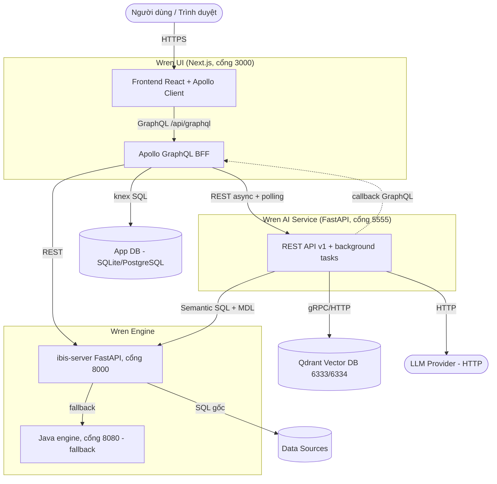

Các điểm cần lưu ý về ranh giới:

- Mỗi cấu phần là **một container riêng**, giao tiếp qua HTTP. `wren-ui` là điểm vào duy nhất của người dùng.
- `wren-ui` (BFF) là **trung tâm điều phối**: nó gọi cả 3 backend service và sở hữu App Database.
- `wren-ai-service` không truy cập App Database; nó dùng Qdrant làm bộ nhớ ngữ nghĩa và gọi ngược lại `wren-ui` (`/api/graphql`) khi cần thực thi SQL preview (engine `wren_ui`).
- `ibis-server` (engine v3, Python) là đường chính; khi xử lý thất bại sẽ **fallback** sang Java engine v2.

### 2.4. Luồng tương tác giữa các service (Service-to-service)

**Pattern bất đồng bộ + polling** là xương sống giao tiếp giữa `wren-ui` và `wren-ai-service`:

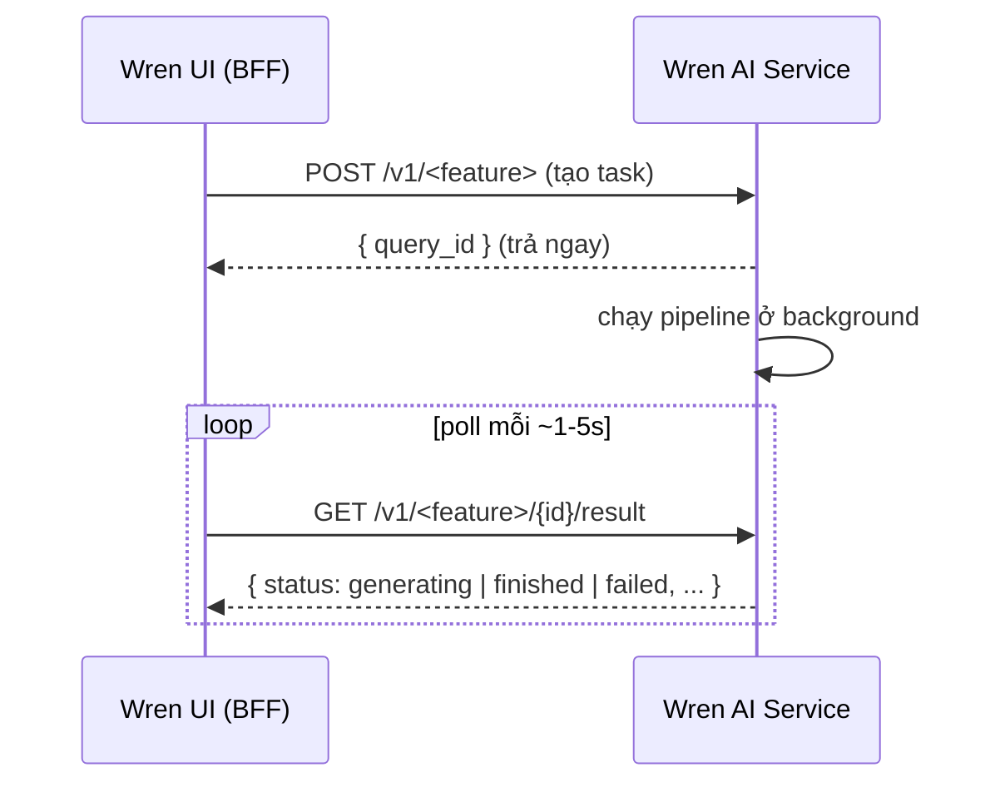

- `wren-ui → wren-ai-service`: dùng `axios` trong `wrenAIAdaptor.ts`. POST tạo task trả `query_id`/`id`/`event_id`; GET poll `{status, response, error}`. Có thêm endpoint **streaming** (SSE) cho câu trả lời dạng văn bản.
  - Ví dụ deploy: `deploy()` poll `GET /v1/semantics-preparations/{id}/status` mỗi **5s**, timeout **120s** (`waitDeployFinished`).
- `wren-ui → ibis-server`: gọi đồng bộ qua `ibisAdaptor.ts` để đọc metadata/constraints và thực thi truy vấn.
- `wren-ai-service → wren-engine`: gửi *Semantic SQL* + *MDL manifest* để validate/thực thi (provider `engine/wren`).
- `wren-ai-service → LLM/Vector DB`: qua LiteLLM (LLM/embedder) và Qdrant client.
- `wren-ai-service → wren-ui` (callback): một số luồng cần thực thi SQL trên engine `wren_ui` sẽ gọi ngược `/api/graphql` — đường này cần auth service-to-service.

### 2.5. Tech stack

| Cấu phần | Ngôn ngữ | Framework chính | Lưu trữ / Hạ tầng |
|---|---|---|---|
| Wren UI | TypeScript | Next.js 14.2, Apollo Server/Client 3.x, knex 3 | SQLite / PostgreSQL |
| Wren AI Service | Python 3.12 | FastAPI, Hamilton (DAG), Haystack 2.7, LiteLLM | Qdrant 1.15 |
| Wren Engine (ibis) | Python 3.11 | FastAPI, Ibis, wren-core-py (PyO3) | — |
| wren-core | Rust | DataFusion (fork Canner) | — |
| Wren Engine (legacy) | Java | — | — |

Phiên bản tại thời điểm tài liệu: `wren-ui` 0.32.2, `wren-ai-service` 0.29.3, Qdrant v1.15.0.

---

## 3. Wren UI — Frontend & BFF

### 3.1. Tổng quan & trách nhiệm

`wren-ui` là một ứng dụng **Next.js 14** đảm nhiệm đồng thời hai vai trò:

1. **Frontend**: render giao diện người dùng (React 18 + Ant Design), gọi GraphQL qua Apollo Client.
2. **Backend-for-Frontend (BFF)**: một Apollo GraphQL Server chạy trong Next.js API route (`pages/api/graphql.ts`). BFF là nơi đặt **toàn bộ logic điều phối**: nhận request từ frontend, gọi tới `wren-ai-service` / `ibis-server` / `wren-engine`, và lưu trạng thái vào App Database.

Đây là cấu phần được tuỳ biến nhiều nhất và là nơi tích hợp hầu hết các tính năng.

### 3.2. Kiến trúc Frontend

- **`src/pages/`** — định tuyến theo file của Next.js. Các luồng chính: `setup/*` (wizard kết nối nguồn dữ liệu & modeling), trang modeling, trang home/ask (hỏi-đáp), dashboard.
- **`src/components/`** — component UI, gồm `components/pages/setup/*` cho wizard.
- **`src/hooks/`** — custom hooks, đặc biệt là các hook **polling** kết quả bất đồng bộ từ BFF.
- **`src/pages/api/`** — các API route ngoài GraphQL: `auth/*` (signin/signup/signout/refresh/me), `ask_task/streaming*` (proxy SSE), `config`, `projects`.
- **Apollo Client + codegen**: các GraphQL document đặt trong `src/apollo/client/graphql/*.ts`; chạy `yarn generate-gql` sinh ra typed hooks (`useXxxQuery/Mutation`). Codegen yêu cầu server đang chạy.
- **Trực quan hoá**: ReactFlow cho sơ đồ modeling; Vega / Vega-Lite cho biểu đồ.

> **Vị trí chèn UI prototype (có sẵn)** — đặt tại mục này để minh hoạ các màn hình chính và luồng điều hướng.

### 3.3. Kiến trúc Backend (Apollo GraphQL BFF)

BFF được tổ chức theo **kiến trúc phân lớp** rõ ràng. Một request GraphQL đi qua các lớp sau:

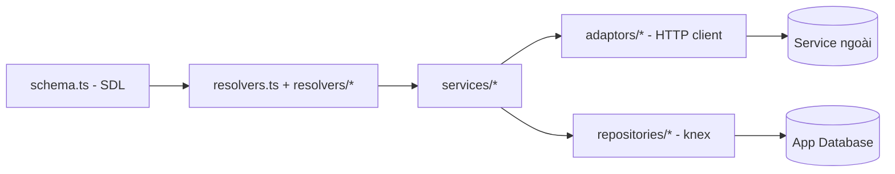

| Lớp | Vị trí | Vai trò |
|---|---|---|
| **Schema (SDL)** | `apollo/server/schema.ts` | Toàn bộ định nghĩa GraphQL (type Query/Mutation + các type) trong một template `gql` |
| **Resolver** | `apollo/server/resolvers.ts`, `resolvers/*.ts` | Map tên Query/Mutation → method của resolver class. Mỗi class bind method trong constructor |
| **Service** | `apollo/server/services/*.ts` | Logic nghiệp vụ: `projectService`, `modelService`, `mdlService`, `askingService`, `deployService`... |
| **Adaptor** | `apollo/server/adaptors/*.ts` | HTTP client tới service khác |
| **Repository** | `apollo/server/repositories/*.ts` | Truy cập App Database qua knex |

**Dependency Injection qua `IContext`** (`types/context.ts`): khi khởi tạo Apollo Server (`pages/api/graphql.ts`), tất cả adaptor/service/repository/background tracker được tạo một lần (trong `components` global) và inject vào mỗi request qua object `context`. Resolver truy cập mọi phụ thuộc qua `ctx`. Điều này giúp resolver không tự khởi tạo phụ thuộc, dễ test và thay thế.

Các resolver hiện có: `projectResolver`, `modelResolver`, `diagramResolver`, `askingResolver`, `dashboardResolver`, `instructionResolver`, `sqlPairResolver`, `learningResolver`, `apiHistoryResolver`, `ontologyResolver`.


### 3.4. Adaptors (tích hợp service ngoài)

| Adaptor | Đích đến | Vai trò |
|---|---|---|
| `wrenAIAdaptor` | `wren-ai-service` | Ask, deploy/indexing, chart, sql-pair, instruction, recommendation, ask-feedback... |
| `ibisAdaptor` | `ibis-server` | Đọc metadata/constraints/FK, thực thi truy vấn |
| `wrenEngineAdaptor` | Java engine | Một số thao tác engine cũ |
| `openMetadataAdaptor` | OpenMetadata (tuỳ chọn) | Connect với OpenMetadata, nếu `.env` không để đúng `OPEN_METADATA_URL`, `OPENMETADATA_TOKEN`thì không sử dụng Adaptor này. |

Đặc điểm `wrenAIAdaptor` (`adaptors/wrenAIAdaptor.ts`):

- Tuân theo pattern async: `ask()` POST `/v1/asks` → `{query_id}`; `getAskResult()` GET `/v1/asks/{id}/result`. Tương tự cho chart, sql-pairs, instructions, recommendation, ask-feedback, relationship/ontology recommendation.
- `deploy()` gửi MDL tới `/v1/semantics-preparations` rồi poll trạng thái tới khi xong/timeout.
- `transformStatusAndError()` chuẩn hoá `status` (uppercase) và **ánh xạ lỗi từ ai-service thành `WrenAIError` cho GraphQL**. Đây là điểm bảo đảm `Error.message` luôn là string — tránh lỗi "String cannot represent value" làm sập query.

### 3.5. App Database (knex repositories)

App Database lưu **toàn bộ trạng thái ứng dụng** (không phải dữ liệu nghiệp vụ của người dùng — dữ liệu đó nằm ở Data Sources). DB mặc định là **SQLite**, có thể chuyển sang **PostgreSQL** qua biến `DB_TYPE`. Schema được quản lý bằng **knex migrations** (`wren-ui/migrations/`).

Các nhóm repository chính (xem chi tiết bảng ở mục 6.2):

- **Modeling**: `projectRepository`, `modelRepository`, `modelColumnRepository`, `modelNestedColumnRepository`, `relationshipRepository`, `viewRepository`, `metricsRepository`.
- **Hỏi-đáp**: `threadRepository`, `threadResponseRepository`, `askingTaskRepository`.
- **Triển khai/đánh chỉ mục**: `deployLogRepository`, `schemaChangeRepository`.
- **Khác**: `dashboardRepository`, `dashboardItemRepository`, `instructionRepository`, `sqlPairRepository`, `apiHistoryRepository`, `learningRepository`, `ontologyRepository`, `userRepository`, `userSessionRepository`.


### 3.6. Background trackers / jobs

Vì `wren-ai-service` trả kết quả bất đồng bộ, BFF dùng các **background tracker** chạy nền (vòng `setInterval`) để poll kết quả từ ai-service và cập nhật App Database. Khi frontend query, nó chỉ đọc trạng thái mới nhất trong DB.

Các tracker (`apollo/server/backgrounds/` + trong `askingService`):

- `BreakdownBackgroundTracker` — poll kết quả phân rã (breakdown) câu trả lời.
- `TextBasedAnswerBackgroundTracker` — poll câu trả lời dạng văn bản.
- `ChartBackgroundTracker`, `ChartAdjustmentBackgroundTracker` — poll sinh/điều chỉnh chart.
- `ThreadRecommendQuestionBackgroundTracker`, `ProjectRecommendQuestionBackgroundTracker` — poll gợi ý câu hỏi.
- `DashboardCacheBackgroundTracker` — làm mới cache dashboard.
- `AdjustmentBackgroundTaskTracker` — điều chỉnh câu trả lời.

`askingService.initialize()` được gọi khi bootstrap server để khôi phục các task đang dang dở.

### 3.7. Các module nghiệp vụ chính

| Module | Resolver | Service | Mô tả |
|---|---|---|---|
| Modeling / Diagram | `modelResolver`, `diagramResolver` | `modelService`, `mdlService` | Định nghĩa model/column/relationship, sinh MDL, vẽ sơ đồ |
| Asking (hỏi-đáp) | `askingResolver` | `askingService` | Tạo asking task, thread, thread response; điều phối toàn bộ luồng hỏi |
| Deploy | (qua project/model) | `deployService` | Triển khai MDL sang ai-service (đánh chỉ mục) |
| Dashboard | `dashboardResolver` | `dashboardService` | Lưu/hiển thị/làm mới biểu đồ |
| Instruction | `instructionResolver` | `instructionService` | Quản lý chỉ dẫn cho LLM |
| SQL Pair | `sqlPairResolver` | `sqlPairService` | Cặp câu hỏi–SQL mẫu |
| Ontology | `ontologyResolver` | `ontologyService` | Lớp ontology (tính năng mới bổ sung) |
| Learning / API History | `learningResolver`, `apiHistoryResolver` | — | Hướng dẫn người dùng & lịch sử gọi API |

`mdlService.makeCurrentModelMDL()` là điểm then chốt: nó dựng MDL manifest hiện tại của project (`{manifest, mdlBuilder}`) để gửi cho ai-service (deploy, recommendation) và cho engine.

---

## 4. Wren AI Service — AI Pipelines

### 4.1. Tổng quan & trách nhiệm

`wren-ai-service` là một dịch vụ **FastAPI** (Python 3.12) chứa toàn bộ tính năng AI của hệ thống. Trách nhiệm:

- **Indexing**: khi deploy, biến MDL/metadata thành embedding lưu vào Vector DB.
- **Retrieval**: truy hồi ngữ cảnh liên quan (schema, sql pairs, instructions, historical questions) từ Vector DB.
- **Generation**: phân loại intent, sinh SQL (text-to-SQL), sửa SQL, sinh câu trả lời, sinh chart, gợi ý câu hỏi/quan hệ/ontology.

Service điều phối 3 hạ tầng ngoài: **LLM Provider** (qua LiteLLM), **Vector DB** (Qdrant), và **Wren Engine** (để validate/thực thi SQL).

### 4.2. Mô hình API bất đồng bộ (Async task pattern)

Mọi tác vụ nặng đều theo pattern bất đồng bộ. Lấy router `ask.py` làm ví dụ chuẩn:

| Method | Endpoint | Vai trò |
|---|---|---|
| `POST` | `/v1/asks` | Tạo `query_id`, đẩy `ask()` vào `BackgroundTasks`, trả ngay `{query_id}` |
| `GET` | `/v1/asks/{query_id}/result` | Poll trạng thái hiện tại |
| `GET` | `/v1/asks/{query_id}/streaming-result` | Trả kết quả dạng SSE (`text/event-stream`) |
| `PATCH` | `/v1/asks/{query_id}` | Dừng tác vụ (`status: stopped`) |

Trạng thái của tác vụ ask (enum trong `services/ask.py`):
`understanding → searching → planning → generating → correcting → finished | failed | stopped`.

Kết quả tạm thời lưu trong `TTLCache` (`_ask_results`) trên bộ nhớ tiến trình.

### 4.3. Kiến trúc Pipeline (Hamilton DAG + Haystack)

Mỗi pipeline được tổ chức thành một **DAG bất đồng bộ** bằng thư viện **Hamilton**. Mô hình code rất nhất quán:

1. Mỗi **node** là một hàm Python (thường `async`), được decorate bằng `@observe` (langfuse tracing). Tên tham số của hàm = tên node phụ thuộc → Hamilton tự suy ra đồ thị phụ thuộc.
2. Prompt template (system + user) khai báo ngay đầu file; dùng **Haystack `PromptBuilder`** để render.
3. Một class kế thừa `BasicPipeline` (`core/pipeline.py`), bọc một `AsyncDriver({}, sys.modules[__name__], result_builder=base.DictResult())`. Method `run()` gọi `self._pipe.execute([...nodes đích...], inputs={...})`.

Ví dụ pipeline `intent_classification` (DAG draft):

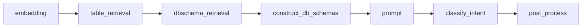

`PipelineComponent` (dataclass) gom 4 phụ thuộc hạ tầng cho mỗi pipeline: `llm_provider`, `embedder_provider`, `document_store_provider`, `engine`.

> **Cần bổ sung**: diagram khái niệm Hamilton DAG tổng quát (hình trên là draft cho 1 pipeline cụ thể).

### 4.4. Providers (lớp trừu tượng)

Để hoán đổi LLM/embedding/vector store/engine dễ dàng, service dùng cơ chế **provider registry**:

- `providers/loader.py`: `import_mods()` quét toàn bộ `src.providers`; decorator `@provider("name")` đăng ký class vào dict `PROVIDERS`; `get_provider("name")` lấy ra.
- Các provider hiện có:
  - `llm/litellm.py` — gọi LLM qua LiteLLM (hỗ trợ OpenAI và nhiều backend).
  - `embedder/litellm.py` — sinh embedding.
  - `document_store/qdrant.py` — Vector DB Qdrant.
  - `engine/wren.py` — gọi Wren Engine để validate/thực thi SQL.

Việc chọn provider cụ thể (model, endpoint, tham số) được điều khiển qua `config.yaml`.

### 4.5. Indexing pipelines

Khi `wren-ui` deploy MDL, ai-service chạy các pipeline indexing (`pipelines/indexing/`) để nạp ngữ cảnh vào Qdrant:

| Pipeline | Nội dung đánh chỉ mục |
|---|---|
| `db_schema` | Cấu trúc bảng/cột từ MDL |
| `table_description` | Mô tả bảng |
| `historical_question` | Câu hỏi lịch sử (view đã lưu) |
| `instructions` | Chỉ dẫn cho LLM |
| `sql_pairs` | Cặp câu hỏi–SQL mẫu |
| `project_meta` | Metadata cấp project |

Đây là phần ứng với *Embedding & Index Processing* trong conceptual diagram.

### 4.6. Retrieval pipelines

Các pipeline retrieval (`pipelines/retrieval/`) truy hồi ngữ cảnh liên quan tới câu hỏi:

| Pipeline | Vai trò |
|---|---|
| `db_schema_retrieval` | Tìm bảng/cột liên quan (đặt vào prompt sinh SQL) |
| `historical_question_retrieval` | Tìm câu hỏi đã trả lời tương tự |
| `sql_pairs_retrieval` | Tìm cặp câu hỏi–SQL mẫu phù hợp |
| `instructions` | Lấy instruction áp dụng cho câu hỏi |
| `sql_functions` | Danh sách hàm SQL của data source |
| `sql_knowledge` | Tri thức SQL bổ trợ (tuỳ chọn) |
| `sql_executor` | Thực thi SQL (qua engine) để lấy dữ liệu |

Đây là phần *Retrieval → Vector Database* trong conceptual diagram.

### 4.7. Generation pipelines

Các pipeline sinh nội dung (`pipelines/generation/`), phân nhóm:

- **Phân loại ý định**: `intent_classification` (đồng thời rephrase câu hỏi).
- **Sinh & sửa SQL**: `sql_generation`, `sql_generation_reasoning`, `followup_sql_generation(_reasoning)`, `sql_regeneration`, `sql_correction`, `sql_diagnosis`, `sql_tables_extraction`.
- **Trả lời & chart**: `sql_answer`, `chart_generation`, `chart_adjustment`.
- **Hỗ trợ & gợi ý**: `data_assistance`, `misleading_assistance`, `user_guide_assistance`, `question_recommendation`, `relationship_recommendation`, `ontology_recommendation`, `semantics_description`, `sql_question`.

### 4.8. RAG & quản lý ngữ cảnh

Luồng text-to-SQL là một quy trình **RAG** (Retrieval-Augmented Generation): trước khi sinh SQL, hệ thống truy hồi và ghép nhiều nguồn ngữ cảnh vào prompt:

- **DB schema** (từ `db_schema_retrieval`) — bảng/cột liên quan.
- **SQL samples** (từ `sql_pairs_retrieval`) — ví dụ câu hỏi–SQL.
- **Instructions** — quy tắc/chỉ dẫn của người dùng.
- **Historical questions** — câu hỏi đã trả lời tương tự.
- **Custom instruction & Ontology** — truyền thêm trong `AskRequest`.

Phần này ứng với *Prompt Builder ← DB Schema / Table description / Instruction / SQL samples* trong conceptual diagram.

### 4.9. Cấu hình & feature flags

Cấu hình tập trung trong `src/config.py` (lớp `Settings` của pydantic-settings), nạp theo thứ tự ưu tiên tăng dần: **default → biến môi trường → `.env.dev` → `config.yaml`**.

Một số tham số quan trọng:

| Nhóm | Tham số (mặc định) |
|---|---|
| Service | `host` (127.0.0.1), `port` (5555) |
| Indexing/Retrieval | `table_retrieval_size` (10), `table_column_retrieval_size` (100), `*_similarity_threshold`, `enable_column_pruning` (false) |
| Generation flags | `allow_intent_classification` (true), `allow_sql_generation_reasoning` (true), `allow_sql_functions_retrieval` (true), `allow_sql_diagnosis` (true), `allow_sql_knowledge_retrieval` (false), `max_histories` (5), `max_sql_correction_retries` (3) |
| Engine | `engine_timeout` (30.0s) |
| Cache | `query_cache_ttl` (3600s), `query_cache_maxsize` |

---

## 5. Wren Engine — Semantic Layer & Connectors

### 5.1. Tổng quan & trách nhiệm

Wren Engine là **lớp ngữ nghĩa (semantic layer)** kiêm **bộ thực thi truy vấn**. Nó nhận:

- **Semantic SQL** (SQL viết theo mô hình logic, tham chiếu tên model/column trong MDL),
- **MDL manifest** (định nghĩa mô hình),
- **Connection info** (thông tin kết nối tới data source),

rồi phân tích MDL, validate, rewrite (mở rộng calculated column / quan hệ), transpile sang dialect SQL gốc của data source, và thực thi để trả về dữ liệu.

### 5.2. Thành phần & ngôn ngữ

| Thành phần | Ngôn ngữ | Vai trò |
|---|---|---|
| `ibis-server` | Python (FastAPI) | API engine v3 (đường chính); điều phối phân tích MDL + thực thi qua Ibis |
| `wren-core` | Rust (DataFusion) | Lõi semantic: phân tích/rewrite SQL theo MDL |
| `wren-core-py` | PyO3 binding | Cầu nối từ Python (ibis-server) gọi vào wren-core (Rust) |
| `wren` (Java) | Java | Engine v2 cũ — đường **fallback** |

Đường xử lý chính (theo `ibis-server/.claude/CLAUDE.md`):

```text
REST client (Wren AI Service / Wren UI)
  → POST /v3/connector/{dataSource}/query (SQL + MDL base64 + connectionInfo)
  → phân tích & validate MDL
  → wren-core-py (PyO3) → wren-core (Rust) → DataFusion
  → biểu thức Ibis → SQL của connector → data source
  → kết quả (+ query cache tuỳ chọn)
  [Nếu v3 lỗi → fallback sang Java engine v2]
```

`ibis-server/app/main.py` khởi tạo FastAPI với `lifespan` tạo singleton `JavaEngineConnector` + `QueryCacheManager`, các middleware (`CorrelationId`, `ProcessTime`, `RequestLog`), và endpoint `/health`, `/config`. Router gồm `v2` (legacy) và `v3` (chính).

### 5.3. MDL & Semantic processing

Module `app/mdl/`:

- `core.py` — `WrenContext`: phân tích manifest, bảng ký hiệu (symbol table), quản lý session.
- `rewriter.py` — logic rewrite truy vấn (mở rộng theo MDL).
- `substitute.py` — thay thế model (model substitution).
- `analyzer.py` — phân tích MDL.
- `java_engine.py` — kết nối tới Java engine (fallback).
- `knowledge.py` — tri thức SQL.

### 5.4. Validator / Rewriter / Transpiler

Mapping các khối trong conceptual diagram vào code thực tế:

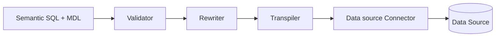

| Khối (diagram) | Code thực tế |
|---|---|
| Validator | `app/model/validator.py`, endpoint `/v3/.../validate` |
| Rewriter | `app/mdl/rewriter.py` (qua wren-core) |
| Transpiler | Ibis + `app/custom_sqlglot/dialects/*` (wren, mysql, doris) |
| Data source Connector | `app/model/connector.py`, `data_source.py`, `app/model/metadata/*` |

Các endpoint chính của router `v3/connector.py`: `query`, `dry-plan`, `dry-plan-for-data-source`, `validate`, `functions`/`function`, `model_substitute`, `get_sql_knowledge`, `get_table_list`, `get_schema_list`, `get_constraints`, `get_db_version`.


### 5.5. Data Source Connectors

Danh sách data source được hỗ trợ (enum `DataSource` trong `app/model/data_source.py`):

`athena`, `bigquery`, `canner`, `clickhouse`, `mssql`, `mysql`, `doris`, `oracle`, `postgres`, `redshift`, `snowflake`, `trino`, `local_file`, `s3_file`, `minio_file`, `gcs_file`, `duckdb`, `spark`, `databricks`.

Mỗi data source có cách build `ConnectionInfo` riêng (hỗ trợ cả `connectionUrl` lẫn tham số rời) và cấu hình timeout đặc thù (ví dụ Postgres dùng `statement_timeout`, ClickHouse dùng `max_execution_time`, BigQuery dùng `job_timeout_ms`). Việc đọc metadata/constraints qua `app/model/metadata/*` (factory tạo connector theo data source).

### 5.6. Query cache & dry plan

- **Query cache** (`app/query_cache/`): `QueryCacheManager` cache kết quả truy vấn (bật qua `QUERY_CACHE_STORAGE_TYPE`).
- **Dry plan**: có hai endpoint:
  - `POST /dry-plan` — nhận semantic SQL + MDL manifest, chạy `Rewriter` và trả ra **WrenSQL đã rewrite** (tức là SQL ngữ nghĩa sau khi mở rộng theo MDL — calculated column, quan hệ... — nhưng chưa dịch sang dialect của bất kỳ data source nào). Dùng để kiểm tra logic rewrite.
  - `POST /{data_source}/dry-plan` — tương tự nhưng truyền thêm `data_source` vào `Rewriter`, trả ra **SQL dialect gốc** của data source đó mà không thực thi. Dùng để xem trước câu SQL sẽ được gửi xuống data source.
  - Phía ai-service có `use_dry_plan` / `allow_dry_plan_fallback` trong `AskRequest` để kiểm tra SQL qua dry-plan trước khi thực thi thật.

---

## 6. Mô hình dữ liệu (Data Model)

### 6.1. MDL (Modeling Definition Language)

MDL là **"semantic manifest"** — định dạng JSON mô tả mô hình ngữ nghĩa, dùng chung giữa `wren-ui` (sinh ra), `wren-ai-service` (đánh chỉ mục + đưa vào prompt) và `wren-engine` (rewrite/thực thi). Schema chính thức: `wren-mdl/mdl.schema.json`.

Các thành phần chính của manifest:

- **models** — bảng logic. Mỗi model có nhiều **column** với thuộc tính: `name`, `type`, `relationship`, `isCalculated`, `notNull`, `expression`, `isHidden`, `columnLevelAccessControl` (rule phân quyền cấp cột với operator EQUALS/NOT_EQUALS/GREATER_THAN...).
- **relationships** — quan hệ giữa các model (one-to-many, ...).
- **metrics** — chỉ số đo lường.
- **views** — truy vấn đã lưu (gắn với historical question).

> **Cần bổ sung**: ví dụ MDL JSON minh hoạ một model + relationship.

### 6.2. App Database (Wren UI)

App Database (SQLite mặc định / PostgreSQL) lưu toàn bộ trạng thái ứng dụng. Schema quản lý bằng knex migrations (`wren-ui/migrations/`). Tổng cộng có **19 bảng** được chia thành 5 nhóm quan hệ dưới đây.

> Các ERD bên dưới được vẽ bằng Mermaid. Ký hiệu: `||--o{` = một-nhiều, `||--||` = một-một, `|o--o{` = tuỳ chọn-nhiều, `}o--||` = nhiều-về-một.

---

#### ERD 1 — User & Auth & Project

Nhóm này mô tả vòng đời xác thực và sở hữu project.

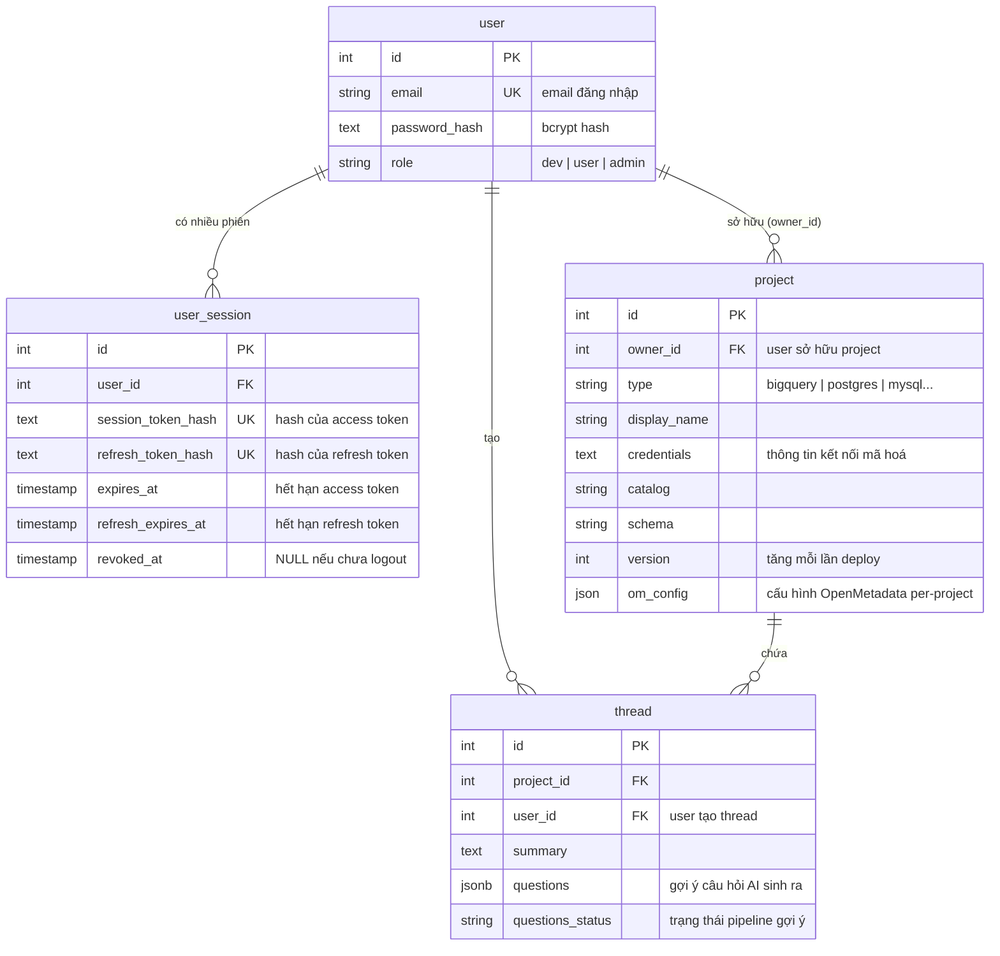

**Mô tả các bảng:**

- **`user`** — tài khoản người dùng trong hệ thống (phần bổ sung trong fork). `role` quy định quyền hạn: `dev` là tài khoản developer quản lý project, `user` là người dùng cuối, `admin` có toàn quyền.
- **`user_session`** — phiên đăng nhập. Lưu hash của access token và refresh token (không lưu token gốc). `revoked_at` được đặt khi logout/thu hồi. Mỗi user có thể có nhiều phiên (đăng nhập từ nhiều thiết bị).
- **`project`** — project kết nối tới một data source. Lưu thông tin kết nối dạng mã hoá trong `credentials`. `owner_id` gắn project với user. `version` tăng mỗi khi deploy MDL để phân biệt các lần đánh chỉ mục. `om_config` lưu cấu hình OpenMetadata riêng của project (`{ serviceName, enabled }`).
- **`thread`** — cuộc hội thoại hỏi-đáp của một user trong một project. `questions` và `questions_status` lưu trạng thái pipeline gợi ý câu hỏi tiếp theo (recommendation questions).

---

#### ERD 2 — Project & Modeling (Semantic Layer)

Nhóm này mô tả cách người dùng định nghĩa mô hình ngữ nghĩa (MDL).

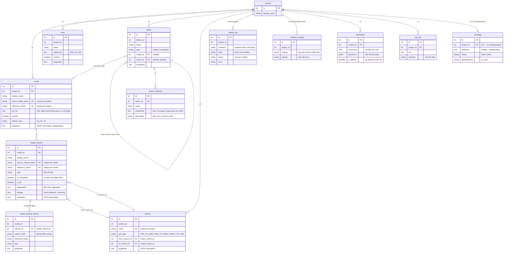

**Mô tả các bảng:**

- **`model`** — bảng logic trong semantic layer, ánh xạ tới một bảng vật lý (`source_table_name`) hoặc một câu SQL (`ref_sql`). `reference_name` là tên dùng trong MDL và câu query. `properties` lưu JSON chứa `description` và `displayName` hiển thị trên UI.
- **`model_column`** — cột của một model. `is_calculated` + `aggregation` + `lineage` dùng cho calculated field (cột được tính từ các cột/quan hệ khác). `lineage` lưu chuỗi `[relationId..., columnId]` mô tả đường đi qua các bảng.
- **`model_nested_column`** — cột lồng nhau (nested), dùng cho data source có kiểu dữ liệu phức hợp (JSON, struct). `column_path` là đường dẫn tới field lồng sâu.
- **`relation`** — quan hệ join giữa hai model, thực chất là giữa hai `model_column`. `join_type` có thể là `ONE_TO_ONE`, `ONE_TO_MANY`, `MANY_TO_ONE`. Cả `from_column_id` và `to_column_id` đều có FK CASCADE vào `model_column`.
- **`metric`** — chỉ số đo lường, dựa trên một `model` hoặc một `metric` khác (tự tham chiếu). Loại `simple` hoặc `cumulative`.
- **`metric_measure`** — phép đo cụ thể của một metric: biểu thức tổng hợp (Sum, Average...) và granularity thời gian.
- **`view`** — truy vấn SQL đã lưu, xuất hiện trong Vector DB như "historical question" để hỗ trợ retrieval.
- **`deploy_log`** — lịch sử các lần deploy MDL lên ai-service. `manifest` lưu snapshot JSON của MDL tại thời điểm deploy; `hash` dùng để phân biệt các phiên bản.
- **`schema_change`** — ghi lại thay đổi schema được phát hiện (cột thêm/xoá/đổi kiểu) và cách đã xử lý.
- **`instruction`** — chỉ dẫn cho LLM khi sinh SQL. `is_default = true` có nghĩa chỉ dẫn này luôn được đưa vào prompt bất kể câu hỏi.
- **`sql_pair`** — cặp câu hỏi–SQL mẫu, được đánh chỉ mục vào Vector DB, dùng trong retrieval để cung cấp few-shot example cho LLM.
- **`ontology`** — định nghĩa ontology của project (tính năng bổ sung trong fork), lưu dạng JSON gồm `entities` (thực thể) và `relationships` (quan hệ). Unique một ontology per project. `status` là `draft` hoặc `active`.

---

#### ERD 3 — Hỏi-đáp (Ask / Thread)

Nhóm này mô tả vòng đời của một cuộc hội thoại text-to-SQL.

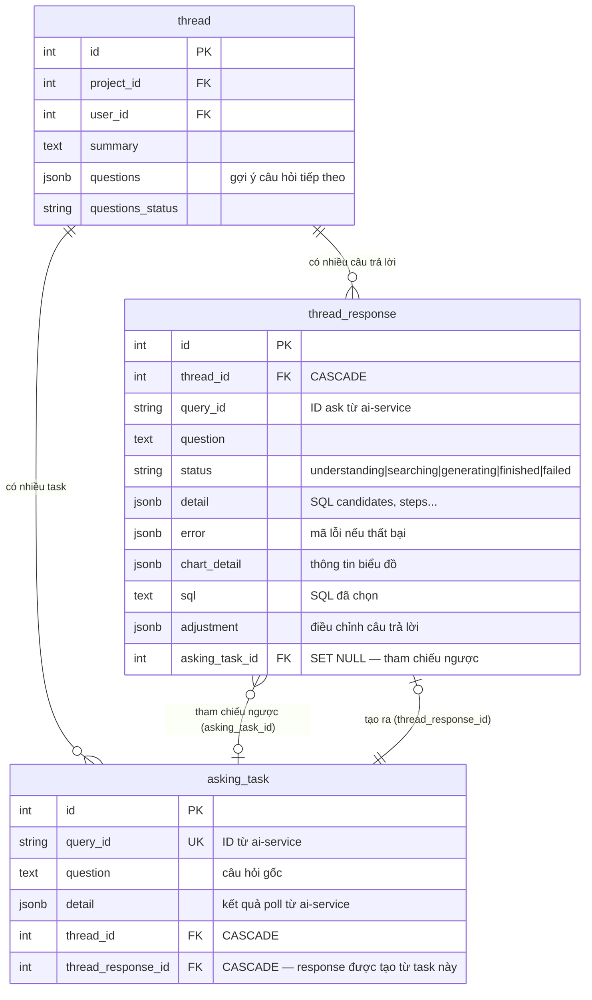

**Mô tả các bảng:**

- **`thread`** — một cuộc hội thoại. Mỗi thread thuộc về một `project` và một `user`. `questions` + `questions_status` lưu kết quả pipeline gợi ý câu hỏi tiếp theo (chạy nền sau khi có câu trả lời).
- **`asking_task`** — đại diện cho một lần gọi tới `/v1/asks` trên ai-service. `query_id` là ID nhận được từ ai-service sau POST. `detail` lưu kết quả poll cuối cùng. `thread_response_id` trỏ tới `thread_response` được tạo khi user chọn SQL candidate từ task này. `thread_id` cho biết task thuộc thread nào (để recover khi khởi động lại).
- **`thread_response`** — một câu trả lời cụ thể trong thread. `status` phản chiếu trạng thái pipeline ai-service: `understanding → searching → planning → generating → correcting → finished | failed`. `detail` chứa SQL candidates và breakdown steps. `chart_detail` lưu schema biểu đồ nếu đã sinh chart. `adjustment` lưu dữ liệu điều chỉnh câu trả lời. `asking_task_id` là tham chiếu ngược tới task đã tạo ra response này (SET NULL khi task bị xoá).

> **Lưu ý về quan hệ vòng**: `asking_task` và `thread_response` tham chiếu lẫn nhau. `asking_task.thread_response_id` được set khi user chọn SQL → response được tạo; `thread_response.asking_task_id` được set sau đó như back-reference. Hai FK này không phải vòng lặp đồng thời — thứ tự set đảm bảo không deadlock.

---

#### ERD 4 — Dashboard

Nhóm này mô tả cơ chế lưu và làm mới biểu đồ trong dashboard.

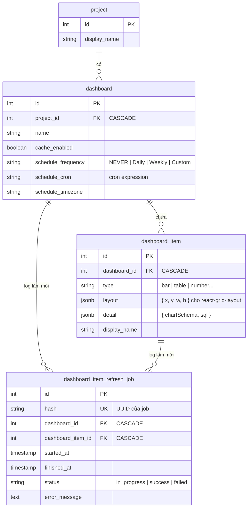

**Mô tả các bảng:**

- **`dashboard`** — bảng tổng hợp biểu đồ của một project. Mỗi project có một dashboard mặc định tạo sẵn khi khởi tạo project. `schedule_*` cho phép đặt lịch làm mới tự động (`NEVER` | `Daily` | `Weekly` | `Custom` với cron expression). `cache_enabled` bật/tắt cache kết quả.
- **`dashboard_item`** — một ô biểu đồ trong dashboard. `type` là loại chart (bar, table, number...). `layout` lưu vị trí và kích thước trên lưới (`{ x, y, w, h }` — dùng với thư viện `react-grid-layout`). `detail` lưu `{ chartSchema, sql }` — SQL để chạy và schema Vega-Lite để render.
- **`dashboard_item_refresh_job`** — bản ghi một lần làm mới cache của một `dashboard_item`. `hash` là UUID dùng để track job. `DashboardCacheBackgroundTracker` tạo bản ghi này mỗi lần chạy refresh, cho phép theo dõi lịch sử và trạng thái.

---

#### ERD 5 — Bảng phụ trợ

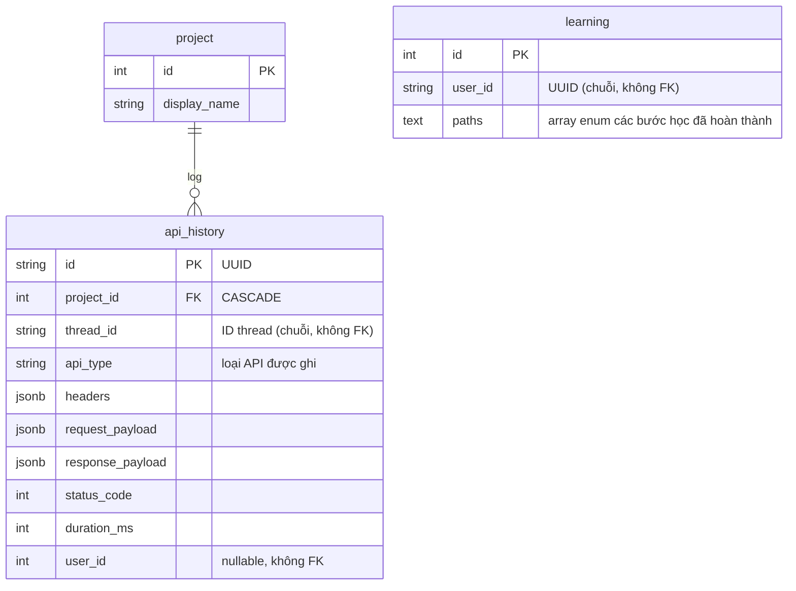

**Mô tả các bảng:**

- **`learning`** — lưu tiến trình hướng dẫn người dùng mới (onboarding). `user_id` là UUID dạng chuỗi (không phải FK tới `user.id` số nguyên — đây là UUID phiên client-side, giữ tương thích với phiên bản trước khi có auth). `paths` là mảng enum các bước tutorial đã hoàn thành.
- **`api_history`** — nhật ký lịch sử gọi API (audit log). `id` là UUID chuỗi. `thread_id` cũng là chuỗi, không có FK cứng (để không mất log khi thread bị xoá). `user_id` là số nguyên tham chiếu lỏng (không có FK constraint) tới `user.id`, nullable để tương thích ngược với log trước khi có auth.

### 6.3. Vector Database (Qdrant)

Qdrant lưu các embedding sinh ra bởi indexing pipelines (mục 4.5). Mỗi loại context là một tập collection riêng:

- DB schema (bảng/cột)
- Table description
- Historical question
- Instructions
- SQL pairs

Embedding được sinh bởi provider `embedder/litellm` và truy hồi theo độ tương đồng (cosine) với các ngưỡng cấu hình trong `config.py`.

---

## 7. Cross-cutting Concerns

### 7.1. Xác thực & phân quyền (Auth)

Auth là phần **bổ sung trong fork** (mặc định bản gốc không có). Cơ chế:

- Các API route `pages/api/auth/*` xử lý `signup`/`signin`/`signout`/`refresh`/`me`. Mật khẩu hash bằng `bcryptjs`.
- Phiên đăng nhập dùng **session token lưu trong cookie**; bảng `user_session` lưu phiên.
- Tại mỗi request GraphQL (`pages/api/graphql.ts`): nếu `authEnabled`, đọc session token từ cookie → `authService.validateSessionToken()` → gắn `currentUser`. Cả `selectedProjectId` cũng được đọc từ cookie (hoạt động kể cả khi auth tắt, phục vụ chuyển project).
- `runWithAuthContext()` dùng **AsyncLocalStorage** để truyền `user` + `selectedProjectId` xuống service/repository mà không phải đổi chữ ký hàm.
- `applyAuthGuard(resolvers)` bọc resolver để chặn truy cập khi chưa đăng nhập.
- Cờ `WREN_AUTH_ENABLED` (mặc định bật; đặt `false` để tắt trong môi trường dev/SIT).
- **Auth service-to-service**: khi ai-service gọi ngược `/api/graphql` (engine `wren_ui`), cần cơ chế xác thực riêng để không bị guard chặn.

Thông tin kết nối data source được mã hoá khi lưu (dùng `encryptionPassword` / `encryptionSalt`).

### 7.2. Cấu hình & quản lý môi trường

| Cấu phần | Nguồn cấu hình | Ghi chú |
|---|---|---|
| Wren UI | Biến môi trường (`config.ts`) | `DB_TYPE`, `SQLITE_FILE`/`PG_URL`, `WREN_ENGINE_ENDPOINT`, `WREN_AI_ENDPOINT`, `IBIS_SERVER_ENDPOINT`, `WREN_AUTH_ENABLED`, `ENCRYPTION_*`, telemetry |
| Wren AI Service | `config.py` + `config.yaml` + `.env` | Thứ tự ưu tiên: default → env → `.env.dev` → `config.yaml`; `CONFIG_PATH` trỏ tới file yaml |
| Wren Engine | Biến môi trường | `WREN_ENGINE_ENDPOINT` (Java fallback), `APP_TIMEOUT_SECONDS`, `WREN_NUM_WORKERS`, `QUERY_CACHE_STORAGE_TYPE` |

Trong docker-compose, các endpoint giữa service được nối qua tên service trên mạng `wren` (ví dụ `WREN_AI_ENDPOINT=http://wren-ai-service:5555`).

### 7.3. Observability & Logging

- **Wren AI Service**: tracing bằng **Langfuse** — decorator `@observe` trên từng node pipeline, `trace_metadata`, `trace_cost` (theo dõi chi phí LLM). Logger `wren-ai-service`.
- **Wren UI**: telemetry qua **PostHog** (`TelemetryEvent`), bật/tắt bằng `TELEMETRY_ENABLED`. Logger `log4js`.
- **Wren Engine (ibis-server)**: `loguru` + `CorrelationIdMiddleware` (gắn `x-correlation-id` mỗi request) + `ProcessTimeMiddleware`; hỗ trợ OpenTelemetry (`OTLP_ENABLED`).

### 7.4. Error handling & Resilience

- **Mã lỗi ask** (`AskError.code`): `NO_RELEVANT_DATA`, `NO_RELEVANT_SQL`, `OTHERS`.
- **Invariant `Error.message` là string**: `wrenAIAdaptor.transformStatusAndError()` luôn chuẩn hoá lỗi từ ai-service thành chuỗi trước khi đưa vào GraphQL, tránh lỗi "String cannot represent value" làm sập cả thread query (đặc biệt với lỗi 422 từ ibis).
- **Tự sửa SQL**: nếu SQL sinh ra không hợp lệ, luồng vào trạng thái `correcting` → `sql_diagnosis` + `sql_correction`, lặp tối đa `max_sql_correction_retries` (mặc định 3).
- **Dry plan fallback**: kiểm tra kế hoạch trước; `allow_dry_plan_fallback` cho phép quay lui.
- **Engine fallback**: ibis-server v3 lỗi → fallback Java engine v2.
- **GraphQL error formatting** (`graphql.ts`): bỏ qua stacktrace cho `DRY_RUN_ERROR`; gửi telemetry cho `INTERNAL_SERVER_ERROR`.

### 7.5. Caching & Performance

- **ai-service**: `TTLCache` cho `_ask_results`; `query_cache_ttl` (mặc định 3600s).
- **engine**: `QueryCacheManager` cache kết quả truy vấn.
- **wren-ui**: `DashboardCacheBackgroundTracker` làm mới cache dashboard; các tracker poll theo `setInterval` (cân bằng giữa độ trễ phản hồi và tải).
- Tham số tinh chỉnh hiệu năng retrieval: `table_retrieval_size`, `enable_column_pruning`, các ngưỡng similarity.

---

## 8. Triển khai & Vận hành (Deployment & Operations)

### 8.1. Mô hình triển khai (Deployment view — draft)

Hệ thống chạy bằng **docker-compose** (`docker/docker-compose.yaml`, kèm các biến thể `dev`/`prod`/`sit`). Tất cả container nằm trên mạng bridge `wren` và chia sẻ một volume `data`.

> **Hình draft** — vẽ lại bằng draw.io khi hoàn thiện.

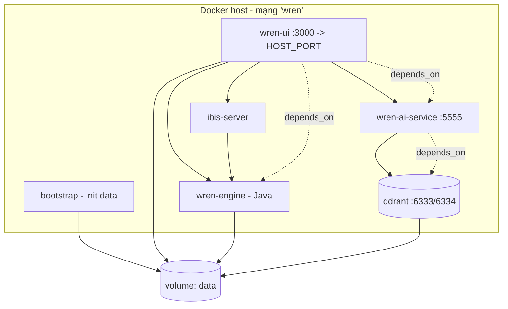

Tóm tắt các container (`docker-compose.yaml`):

| Service | Image | Cổng | Phụ thuộc |
|---|---|---|---|
| `bootstrap` | wren-bootstrap | — | khởi tạo volume `data` |
| `wren-engine` | wren-engine (Java) | `WREN_ENGINE_PORT`, `WREN_ENGINE_SQL_PORT` | bootstrap |
| `ibis-server` | wren-engine-ibis | `IBIS_SERVER_PORT` | (gọi wren-engine) |
| `wren-ai-service` | wren-ai-service | `WREN_AI_SERVICE_PORT` (5555) | qdrant |
| `qdrant` | qdrant v1.15.0 | 6333, 6334 | — |
| `wren-ui` | wren-ui | `HOST_PORT`→3000 | wren-ai-service, wren-engine |

`wren-ui` nhận các endpoint nội bộ qua biến môi trường (`WREN_ENGINE_ENDPOINT`, `WREN_AI_ENDPOINT`, `IBIS_SERVER_ENDPOINT`) và dùng SQLite (`SQLITE_FILE=/app/data/db.sqlite3`) trên volume chia sẻ.

### 8.2. CI/CD & Môi trường triển khai

Hệ thống có **3 môi trường** (production, SIT, development), mỗi môi trường gắn với một cặp file `docker-compose` + file `.env` riêng. Cơ chế lựa chọn môi trường khi chạy lệnh:

```bash
docker compose --env-file <.env|.env.sit|.env.dev> -f docker-compose.<prod|sit|dev>.yaml <command>
```

Việc tách `--env-file` và `-f` cho phép chuyển đổi môi trường chỉ bằng cách đổi tham số, giúp test và vận hành nhiều môi trường trên cùng một codebase mà không phải sửa file.

| Môi trường | docker-compose | env file | Nguồn image | Cách triển khai |
|---|---|---|---|---|
| **Production** | `docker-compose.prod.yaml` | `.env` | Pull image tag `:latest` từ Docker Hub | CI build & push → SSH vào VM → pull & up |
| **SIT** | `docker-compose.sit.yaml` | `.env.sit` | Pull image tag `:sit` từ Docker Hub | CI build & push → máy local tự pull & up |
| **Development** | `docker-compose.dev.yaml` | `.env.dev` | **Build tại chỗ** (`*:local`) | Build & up trực tiếp trên máy dev |


#### 8.2.1. Luồng Production (deploy.yml)

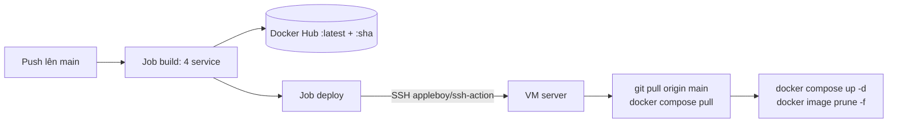

Job `deploy` (chạy sau khi `build` xong) dùng `appleboy/ssh-action` SSH vào VM (`secrets.VM_HOST/VM_USER/VM_SSH_KEY/VM_PORT`) và thực thi:

```bash
cd /workspace/wren-ai
git pull origin main
cd /workspace/wren-ai/docker
docker compose --env-file .env -f docker-compose.prod.yaml pull
docker compose --env-file .env -f docker-compose.prod.yaml up -d
docker image prune -f
docker compose --env-file .env -f docker-compose.prod.yaml ps
```

→ Production là luồng **tự động hoàn toàn**: push `main` là tự build, push image, rồi server tự cập nhật.

#### 8.2.2. Luồng SIT (sit.yml)

Workflow SIT **chỉ build & push** image tag `:sit` lên Docker Hub khi push lên nhánh `dev`. Không có bước deploy tự động. Máy chạy SIT (thường là máy local của tester) **tự pull và up**:

```bash
docker compose --env-file .env.sit -f docker-compose.sit.yaml pull
docker compose --env-file .env.sit -f docker-compose.sit.yaml up -d
```

→ SIT cho phép tester chủ động kéo bản mới về kiểm thử khi cần, thay vì bị cập nhật tự động.

#### 8.2.3. Luồng Development (dev)

Môi trường dev **không qua CI** — image được **build trực tiếp tại máy** từ source code (`build:` context trong `docker-compose.dev.yaml`):

```bash
docker compose --env-file .env.dev -f docker-compose.dev.yaml up -d --build
```

→ Dev dùng để phát triển và kiểm thử thay đổi cục bộ trước khi đẩy lên nhánh `dev` (SIT) hay `main` (prod).

#### 8.2.4. Lưu ý
**Lưu ý về image `wren-engine`**: `docker-compose.prod.yaml` và `docker-compose.sit.yaml` cố tình trỏ tới image upstream `ghcr.io/canner/wren-engine:0.22.0` thay vì image Java tự build. Lý do chính là trong quá trình phát triển, việc tự build `wren-engine` (Java) gặp lỗi chưa khắc phục được nên chuyển sang dùng image gốc của tác giả. Điều này **không ảnh hưởng đến việc tuỳ biến tầng engine**, vì:
- `wren-engine` (Java) chỉ là **engine v2 dùng cho fallback** — không nằm trên đường xử lý chính.
- **Lõi semantic thật sự là `wren-core` (Rust) + `wren-core-py`, được build *chung* với `ibis-server`** (xem `wren-engine/ibis-server/Dockerfile`: các build-context `wren-core`, `wren-core-py`, `wren-core-base` được copy vào và compile thành wheel bằng `maturin build --release` ngay trong image ibis-server). Mà `ibis-server` *do CI tự build & push* (`:latest`/`:sit`).

Mọi thay đổi mã nguồn ở tầng engine v3 (Rust/`wren-core`) đều được đóng gói qua `ibis-server` và đi qua CI bình thường. Chỉ riêng nhánh fallback Java là dùng image upstream cố định.

---

## 9. Lịch sử thay đổi tài liệu

| Phiên bản | Ngày | Người sửa | Nội dung |
|---|---|---|---|
| 1.0 | 2026-06-25 | — | Phiên bản đầu tiên|
